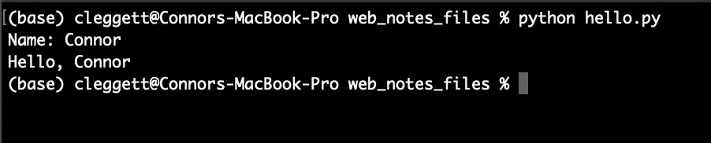
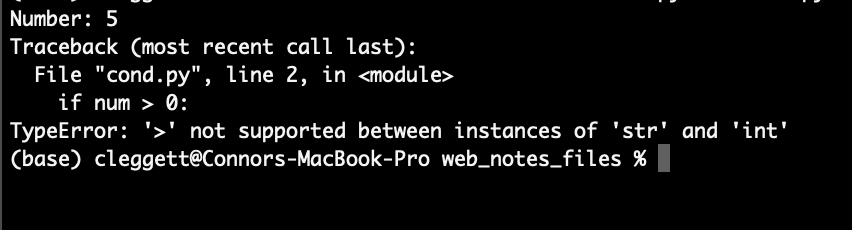
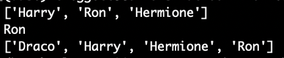
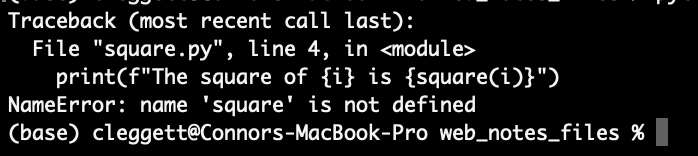
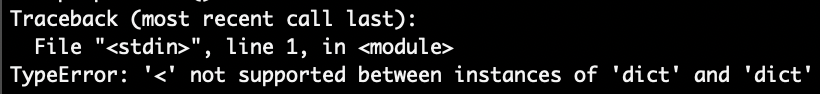
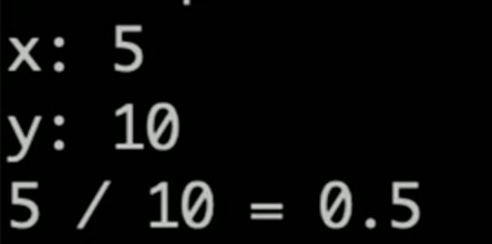
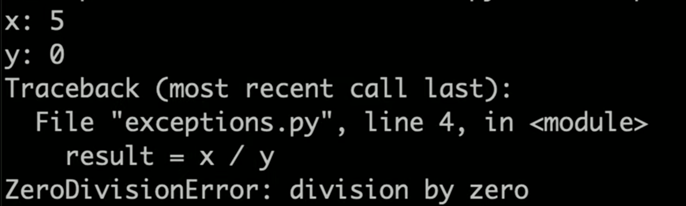
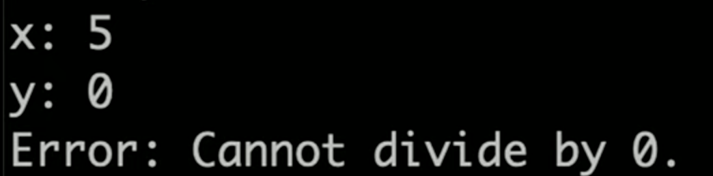
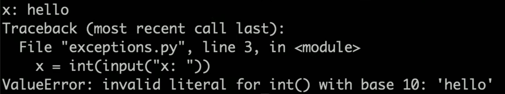

        

            

                <aside class="col-md">

                    <header>
# [CS50’s Web Programming with Python and JavaScript](../..)

OpenCourseWare

[Brian Yu](https://brianyu.me)  
&#10;[brian@cs.harvard.edu](mailto:brian@cs.harvard.edu)

[David J. Malan](https://cs.harvard.edu/malan/)  
&#10;[malan@harvard.edu](mailto:malan@harvard.edu)  
&#10;[<i class="fab fa-facebook-f"></i>](https://www.facebook.com/dmalan)[<i class="fab fa-github"></i>](https://github.com/dmalan)[<i class="fab fa-instagram"></i>](https://www.instagram.com/davidjmalan/)[<i class="fab fa-linkedin"></i>](https://www.linkedin.com/in/malan/)[<i class="fab fa-quora"></i>](https://www.quora.com/profile/David-J-Malan)[<i class="fab fa-reddit-alien"></i>](https://www.reddit.com/user/davidjmalan)[<i class="fab fa-twitter"></i>](https://twitter.com/davidjmalan)

</header>

                    <button aria-controls="nav" aria-expanded="false" class="btn btn-sm collapsed d-md-none" data-target="aside > nav" data-toggle="collapse">
                        Menu
                    </button>

                    <nav class="collapse d-md-block" id="nav">
- - -

1. [HTML, CSS](../../weeks/0/)

1. [Git](../../weeks/1/)

1. [Python](../../weeks/2/)

1. [Django](../../weeks/3/)

1. [SQL, Models, and Migrations](../../weeks/4/)

1. [JavaScript](../../weeks/5/)

1. [User Interfaces](../../weeks/6/)

1. [Testing, CI/CD](../../weeks/7/)

1. [Scalability and Security](../../weeks/8/)

- - -

- [CS50 Certificate](../../certificate/)

- [FAQs](../../faqs/)

- - -

- [Ed Discussion](https://cs50.harvard.edu/web/ed) for Q&amp;A

- [Quick Start Guide](https://us.edstem.org/quickstart/ed-discussion.pdf)

- - -

- [edX](https://cs50.edx.org/web)

- [iTunes U](https://itunes.apple.com/us/course/id1505432709)

- [YouTube](https://www.youtube.com/playlist?list=PLhQjrBD2T380xvFSUmToMMzERZ3qB5Ueu)

- - -

- [Changelog](https://cs50.noticeable.io/)

- [Status Page](https://cs50.statuspage.io/)

- - -

-

    [Communities](../../communities/)

- [Discord](https://discord.gg/cs50)

- [Facebook Group](https://www.facebook.com/groups/cs50/)

- [Facebook Page](https://www.facebook.com/cs50/)

- [GitHub](https://github.com/cs50)

- [Gitter](https://gitter.im/cs50/x)

- [Instagram](https://instagram.com/cs50)

- [LinkedIn Group](https://www.linkedin.com/groups/7437240/)

- [LinkedIn Page](https://www.linkedin.com/school/CS50/)

- [Quora](https://www.quora.com/topic/CS50)

- [Slack](https://cs50.edx.org/slack)

- [Snapchat](https://www.snapchat.com/add/cs50)

- [Twitter](https://twitter.com/cs50)

- [YouTube](http://www.youtube.com/subscription_center?add_user=cs50tv)

- - -

- - -

[<i class="fab fa-creative-commons mr-1"></i>License](../../license/)

</nav>

                    <footer></footer>

                </aside>

                <main class="col-md markdown-body">

                    # Lecture 2

  - [Introduction](#introduction)
  - [Python](#python)
  - [Variables](#variables)
  - [Formatting Strings](#formatting-strings)
  - [Conditions](#conditions)
  - [Sequences](#sequences)    
                  - [Strings](#strings)
                  - [Lists](#lists)
                  - [Tuples](#tuples)
                  - [Sets](#sets)
                  - [Dictionaries](#dictionaries)
                  - [Loops](#loops)

  - [Functions](#functions)
  - [Modules](#modules)
  - [Object-Oriented Programming](#object-oriented-programming)
  - [Functional Programming](#functional-programming)    
                  - [Decorators](#decorators)
                  - [Lambda Functions](#lambda-functions)

  - [Exceptions](#exceptions)

## Introduction

  - So far, we’ve discussed how to build simple web pages using HTML and CSS, and how to use Git and GitHub in order to keep track of changes to our code and collaborate with others.
  - Today, we’ll dive into Python, one of the two main programming languages we’ll use throughout this course.

## Python

  -
        Python is a very powerful and widely-used language that will allow us to quickly build fairly complicated web applications. In this course, we’ll be using Python 3, although Python 2 is still in use in some places. When looking at outside resources, be careful to make sure they’re using the same version.

  -
        Let’s start where we start with many programming languages: Hello, world. This program, written in Python, would look like this:

<pre class="highlight"><code>print("Hello, world!")
</code></pre>

  - To break down what’s going on in that line, there is a `print` **function** built in to the python language, that takes an **argument** in parentheses, and displays that argument on the command line.
  - To actually write and run this program on your computers, you’ll first type this line into your text editor of choice, and then save the file as `something.py`. Next, you’ll head over to your terminal, navigate to the directory containing your file, and type `python something.py`. In the case of the above program, the words “Hello, world!” will then be displayed in the terminal.
  - Depending on how your computer is set up, you may have to type `python3` instead of `python` before the file name, and you may even have to [download Python](https://www.python.org/downloads/) if you haven’t already. After installing Python, we recommend that you also [download Pip](https://pip.pypa.io/en/stable/installing/), as you’ll need that later in the course.
  - When you type `python file.py` in your terminal, a program called an **interpreter**, which you downloaded together with Python, reads through your file line by line, and executes each line of the code. This is different than languages like **C** or **Java**, which need to be **compiled** into machine code before they can be run.

## Variables

A key part of any programming language is the ability to create and manipulate variables. In order to assign a value to a variable in Python, the syntax looks like this:

<pre class="highlight"><code>a = 28
b = 1.5
c = "Hello!"
d = True
e = None
</code></pre>

Each of these lines is taking the value to the right of the `=`, and storing it in the variable name to the left.

Unlike in some other programming languages, Python variable types are inferred, meaning that while each variable does have a type, we do not have to explicitly state which type it is when we create the variable. Some of the most common variable types are:

  - **int**: An integer
  - **float**: A decimal number
  - **chr**: A single character
  - **str**: A string, or sequence of characters
  - **bool**: A value that is either `True` or `False`
  - **NoneType**: A special value (`None`) indicating the absence of a value.

Now, we’ll work on writing a more interesting program that can take input from the user and say hello to that user. To do this, we’ll use another built in function called `input` which displays a prompt to the user, and returns whatever the user provides as input. For example, we can write the following in a file called `name.py`:

<pre class="highlight"><code>name = input("Name: ")
print("Hello, " + name)
</code></pre>

When run on the terminal, this is what the program looks like:

A couple of things to point out here:

  - In the first line, instead of assigning the variable name to an explicit value, we’re assigning it to whatever the `input` function returns.
  - In the second line, we’re using the `+` operator to combine, or **concatenate**, two strings. In python, the `+` operator can be used to add numbers or concatenate strings and lists.

## Formatting Strings

  - While we can use the `+` operator to combine strings as we did above, in the latest versions of python, there are even easier ways to work with strings, known as [formatted strings](https://realpython.com/python-f-strings/), or **f-strings** for short.
  - To indicate that we’re using formatted strings, we simply add an `f` before the quotation marks. For example, instead of using `"Hello, " + name` as we did above, we could write `f"Hello, {name}"` for the same result. We can even plug a function into this string if we want, and turn our program above into the single line:

<pre class="highlight"><code>print(f"Hello, {input("Name: ")}")
</code></pre>

## Conditions

  - Just like in other programming languages, Python gives us the ability to run different segments of code based on different [conditions](https://realpython.com/python-conditional-statements/). For example, in the program below, we’ll change our output depending on the number a user types in:

<pre class="highlight"><code>num = input("Number: ")
if num &gt; 0:
    print("Number is positive")
elif num &lt; 0:
    print("Number is negative")
else:
    print("Number is 0")
</code></pre>

  - Getting into how the above program works, conditionals in python contain a keyword (`if`, `elif`, or `else`) and then (except in the `else` case) a boolean expression, or an expression that evaluates to either `True` or `False`. Then, all of the code we want to run if a certain expression is true is **indented** directly below the statement. Indentation is required as part of the Python syntax.
  - However, when we run this program, we run into an [exception](https://docs.python.org/3/tutorial/errors.html) that looks like this:

  - An exception is what happens when an error occurs while we’re running our python code, and over time you’ll get better and better at interpreting these errors, which is a very valuable skill to have.
  - Let’s look a bit more closely at this specific exception: If we look at the bottom, we’ll see that we ran into a `TypeError`, which generally means Python expected a certain variable to be of one type, but found it to be of another type. In this case, the exception tells us that we cannot use the `&gt;` symbol to compare a `str` and `int`, and then above we can see that this comparison occurs in line 2.
  - In this case, it’s obvious that `0` is an integer, so it must be the case that our `num` variable is a string. This is happening because it turns out that the `input` function always returns a string, and we have to specify that it should be turned into (or **cast** into) an integer using the `int` function. This means our first line would now look like:

<pre class="highlight"><code>num = int(input("Number: "))
</code></pre>

  - Now, the program will work just as we intended!

## Sequences

One of the most powerful parts of the Python language is its ability to work with **sequences** of data in addition to individual variables.

There are several types of sequences that are similar in some ways, but different in others. When explaining those differences, we’ll use the terms **mutable/immutable** and **ordered/unordered**. **Mutable** means that once a sequence has been defined, we can change individual elements of that sequence, and **ordered** means that the order of the objects matters.

### Strings

<dl>
  <dt>: <strong>Ordered</strong>: Yes</dt>
  <dd>
    
<strong>Mutable</strong>: No

  </dd>
  <dd>
    
We’ve already looked at strings a little bit, but instead of just variables, we can think of a string as a sequence of characters. This means we can access individual elements within the string! For example:

  </dd>
</dl>

<pre class="highlight"><code>name = "Harry"
print(name[0])
print(name[1])
</code></pre>

prints out the first (or index-0) character in the string, which in this case happens to be `H`, and then prints out the second (or index-1) character, which is `a`.

### Lists

<dl>
  <dt>: <strong>Ordered</strong>: Yes</dt>
  <dd>
    
<strong>Mutable</strong>: Yes

  </dd>
  <dd>
    
A <a href="https://www.w3schools.com/python/python_lists.asp">Python list</a> allows you to store any variable types. We create a list using square brackets and commas, as shown below. Similarly to strings, we can print an entire list, or some individual elements. We can also add elements to a list using <code class="highlighter-rouge">append</code>, and sort a list using <code class="highlighter-rouge">sort</code>

  </dd>
</dl>

<pre class="highlight"><code># This is a Python comment
names = ["Harry", "Ron", "Hermione"]
# Print the entire list:
print(names)
# Print the second element of the list:
print(names[1])
# Add a new name to the list:
names.append("Draco")
# Sort the list:
names.sort()
# Print the new list:
print(names)
</code></pre>

### Tuples

<dl>
  <dt>: <strong>Ordered</strong>: Yes</dt>
  <dd>
    
<strong>Mutable</strong>: No

  </dd>
  <dd>
    
<a href="https://www.w3schools.com/python/python_tuples.asp">Tuples</a> are generally used when you need to store just two or three values together, such as the x and y values for a point. In Python code, we use parentheses:

  </dd>
</dl>

<pre class="highlight"><code>point = (12.5, 10.6)
</code></pre>

### Sets

<dl>
  <dt>: <strong>Ordered</strong>: No</dt>
  <dd>
    
<strong>Mutable</strong>: N/A

  </dd>
  <dd>
    
<a href="https://www.w3schools.com/python/python_sets.asp">Sets</a> are different from lists and tuples in that they are <strong>unordered</strong>. They are also different because while you can have two or more of the same elements within a list/tuple, a set will only store each value once. We can define an empty set using the <code class="highlighter-rouge">set</code> function. We can then use <code class="highlighter-rouge">add</code> and <code class="highlighter-rouge">remove</code> to add and remove elements from that set, and the <code class="highlighter-rouge">len</code> function to find the set’s size. Note that the <code class="highlighter-rouge">len</code> function works on all sequences in python. Also note that despite adding <code class="highlighter-rouge">4</code> and <code class="highlighter-rouge">3</code> to the set twice, each item can only appear once in a set.

  </dd>
</dl>

<pre class="highlight"><code># Create an empty set:
s = set()

# Add some elements:
s.add(1)
s.add(2)
s.add(3)
s.add(4)
s.add(3)
s.add(1)

# Remove 2 from the set
s.remove(2)

# Print the set:
print(s)

# Find the size of the set:
print(f"The set has {len(s)} elements.")

""" This is a python multi-line comment:
Output:
{1, 3, 4}
The set has 3 elements.
"""
</code></pre>

### Dictionaries

<dl>
  <dt>: <strong>Ordered</strong>: No</dt>
  <dd>
    
<strong>Mutable</strong>: Yes

  </dd>
  <dd>
    
<a href="https://www.w3schools.com/python/python_dictionaries.asp">Python Dictionaries</a> or <code class="highlighter-rouge">dict</code>s, will be especially useful in this course. A dictionary is a set of <strong>key-value pairs</strong>, where each key has a corresponding value, just like in a dictionary, each word (the key) has a corresponding definition (the value). In Python, we use curly brackets to contain a dictionary, and colons to indicate keys and values. For example:

  </dd>
</dl>

<pre class="highlight"><code># Define a dictionary
houses = {"Harry": "Gryffindor", "Draco": "Slytherin"}
# Print out Harry's house
print(houses["Harry"])
# Adding values to a dictionary:
houses["Hermione"] = "Gryffindor"
# Print out Hermione's House:
print(houses["Hermione"])

""" Output:
Gryffindor
Gryffindor
"""
</code></pre>

### Loops

Loops are an incredibly important part of any programming language, and in Python, they come in two main forms: [for loops](https://www.w3schools.com/python/python_for_loops.asp) and [while loops](https://www.w3schools.com/python/python_while_loops.asp). For now, we’ll focus on For Loops.

  - For loops are used to iterate over a sequence of elements, performing some block of code (indented below) for each element in a sequence. For example, the following code will print out the numbers from 0 to 5:

<pre class="highlight"><code>for i in [0, 1, 2, 3, 4, 5]:
    print(i)

""" Output:
0
1
2
3
4
5
"""
</code></pre>

  - We can condense this code using the python `range` function, which allows us to easily get a sequence of numbers. The following code gives the exact same result as our code from above:

<pre class="highlight"><code>for i in range(6):
    print(i)

""" Output:
0
1
2
3
4
5
"""
</code></pre>

  - This type of loop can work for any sequence! For example, if we wish to print each name in a list, we could write the code below:

<pre class="highlight"><code># Create a list:
names = ["Harry", "Ron", "Hermione"]

# Print each name:
for name in names:
    print(name)

""" Output:
Harry
Ron
Hermione
"""
</code></pre>

  - We can get even more specific if we want, and loop through each character in a single name!

<pre class="highlight"><code>name = "Harry"
for char in name:
    print(char)

""" Output:
H
a
r
r
y
"""
</code></pre>

## Functions

We’ve already seen a few python functions such as `print` and `input`, but now we’re going to dive into writing our own functions. To get started, we’ll write a function that takes in a number and squares it:

<pre class="highlight"><code>def square(x):
    return x * x
</code></pre>

Notice how we use the `def` keyword to indicate we’re defining a function, that we’re taking in a single input called `x` and that we use the `return` keyword to indicate what the function’s output should be.

We can then “call” this function just as we’ve called other ones: using parentheses:

<pre class="highlight"><code>for i in range(10):
    print(f"The square of {i} is {square(i)}")

""" Output:
The square of 0 is 0
The square of 1 is 1
The square of 2 is 4
The square of 3 is 9
The square of 4 is 16
The square of 5 is 25
The square of 6 is 36
The square of 7 is 49
The square of 8 is 64
The square of 9 is 81
"""
</code></pre>

## Modules

As our projects get larger and larger, it will become useful to be able to write functions in one file and run them in another. In the case above, we could create create one file called `functions.py` with the code:

<pre class="highlight"><code>def square(x):
    return x * x
</code></pre>

And another file called `square.py` with the code:

<pre class="highlight"><code>for i in range(10):
    print(f"The square of {i} is {square(i)}")
</code></pre>

However, when we try to run `square.py`, we run into the following error:

We run into this problem because by default, Python files don’t know about each other, so we have to explicitly `import` the square function from the `functions` **module** we just wrote. Now, when `square.py` looks like this:

<pre class="highlight"><code>from functions import square

for i in range(10):
    print(f"The square of {i} is {square(i)}")
</code></pre>

Alternatively, we can choose to import the entire `functions` module and then use dot notation to access the `square` function:

<pre class="highlight"><code>import functions

for i in range(10):
    print(f"The square of {i} is {functions.square(i)}")
</code></pre>

There are many built-in Python modules we can import such as `math` or `csv` that give us access to even more functions. Additionally, we can download even more Modules to access even more functionality! We’ll spend a lot of time using the `Django` Module, which we’ll discuss in the next lecture.

## Object-Oriented Programming

[Object Oriented Programming](https://en.wikipedia.org/wiki/Object-oriented_programming) is a programming paradigm, or a way of thinking about programming, that is centered around objects that can store information and perform actions.

  - **Classes**: We’ve already seen a few different types of variables in python, but what if we want to create our own type? A [Python Class](https://www.w3schools.com/python/python_classes.asp) is essentially a template for a new type of object that can store information and perform actions. Here’s a class that defines a two-dimensional point:

<pre class="highlight"><code>class Point():
    # A method defining how to create a point:
    def __init__(self, x, y):
        self.x = x
        self.y = y
</code></pre>

  - Note that in the above code, we use the keyword `self` to represent the object we are currently working with. `self` should be the first argument for any method within a Python class.

Now, let’s see how we can actually use the class from above to create an object:

<pre class="highlight"><code>p = Point(2, 8)
print(p.x)
print(p.y)

""" Output:
2
8
"""
</code></pre>

Now, let’s look at a more interesting example where instead of storing just the coordinates of a Point, we create a class that represents an airline flight:

<pre class="highlight"><code>class Flight():
    # Method to create new flight with given capacity
    def __init__(self, capacity):
        self.capacity = capacity
        self.passengers = []

    # Method to add a passenger to the flight:
    def add_passenger(self, name):
        self.passengers.append(name)
</code></pre>

However, this class is flawed because while we set a capacity, we could still add too many passengers. Let’s augment it so that before adding a passenger, we check to see if there is room on the flight:

<pre class="highlight"><code>class Flight():
    # Method to create new flight with given capacity
    def __init__(self, capacity):
        self.capacity = capacity
        self.passengers = []

    # Method to add a passenger to the flight:
    def add_passenger(self, name):
        if not self.open_seats():
            return False
        self.passengers.append(name)
        return True

    # Method to return number of open seats
    def open_seats(self):
        return self.capacity - len(self.passengers)
</code></pre>

Note that above, we use the line `if not self.open_seats()` to determine whether or not there are open seats. This works because in Python, the number 0 can be interpretted as meaning `False`, and we can also use the keyword `not` to signify the opposite of the following statement so `not True` is `False` and `not False` is `True`. Therefore, if `open_seats` returns 0, the entire expression will evaluate to `True`

Now, let’s try out the class we’ve created by instantiating some objects:

<pre class="highlight"><code># Create a new flight with o=up to 3 passengers
flight = Flight(3)

# Create a list of people
people = ["Harry", "Ron", "Hermione", "Ginny"]

# Attempt to add each person in the list to a flight
for person in people:
    if flight.add_passenger(person):
        print(f"Added {person} to flight successfully")
    else:
        print(f"No available seats for {person}")

""" Output:
Added Harry to flight successfully
Added Ron to flight successfully
Added Hermione to flight successfully
No available seats for Ginny
"""
</code></pre>

## Functional Programming

In addition to supporting Object-Oriented Programming, Python also supports the [Functional Programming Paradigm](https://en.wikipedia.org/wiki/Functional_programming), in which functions are treated as values just like any other variable.

### Decorators

One thing made possible by functional programming is the idea of a decorator, which is a higher-order function that can modify another function. For example, let’s write a decorator that announces when a function is about to begin, and when it ends. We can then apply this decorator using an `@` symbol.

<pre class="highlight"><code>def announce(f):
    def wrapper():
        print("About to run the function")
        f()
        print("Done with the function")
    return wrapper

@announce
def hello():
    print("Hello, world!")

hello()

""" Output:
About to run the function
Hello, world!
Done with the function
"""
</code></pre>

### Lambda Functions

Lambda functions provide another way to create functions in python. For example, if we want to define the same `square` function we did earlier, we can write:

<pre class="highlight"><code>square = lambda x: x * x
</code></pre>

Where the input is to the left of the `:` and the output is on the right.

This can be useful when we don’t want to write a whole separate function for a single, small use. For example, if we want to sort some objects where it’s not clear at first how to sort them. Imagine we have a list of people, but with names and houses instead of just names that we wish to sort:

<pre class="highlight"><code>people = [
    {"name": "Harry", "house": "Gryffindor"},
    {"name": "Cho", "house": "Ravenclaw"},
    {"name": "Draco", "house": "Slytherin"}
]

people.sort()

print(people)
</code></pre>

This, however, leaves us with the error:

Which occurs because Python doesn’t know how to compare two Dictionaries to check if one is less than the other.

We can solve this problem by including a `key` argument to the sort function, which specifies which part of the dictionary we wish to use to sort:

<pre class="highlight"><code>people = [
    {"name": "Harry", "house": "Gryffindor"},
    {"name": "Cho", "house": "Ravenclaw"},
    {"name": "Draco", "house": "Slytherin"}
]

def f(person):
    return person["name"]

people.sort(key=f)

print(people)

""" Output:
[{'name': 'Cho', 'house': 'Ravenclaw'}, {'name': 'Draco', 'house': 'Slytherin'}, {'name': 'Harry', 'house': 'Gryffindor'}]
"""
</code></pre>

While this does work, we’ve had to write an entire function that we’re only using once, we can make our code more readable by using a lambda function:

<pre class="highlight"><code>people = [
    {"name": "Harry", "house": "Gryffindor"},
    {"name": "Cho", "house": "Ravenclaw"},
    {"name": "Draco", "house": "Slytherin"}
]

people.sort(key=lambda person: person["name"])

print(people)

""" Output:
[{'name': 'Cho', 'house': 'Ravenclaw'}, {'name': 'Draco', 'house': 'Slytherin'}, {'name': 'Harry', 'house': 'Gryffindor'}]
"""
</code></pre>

## Exceptions

During this lecture, we’ve run into a few different exceptions, so now we’ll look into some new ways of dealing with them.

In the following chunk of code, we’ll take two integers from the user, and attempt to divide them:

<pre class="highlight"><code>x = int(input("x: "))
y = int(input("y: "))

result = x / y

print(f"{x} / {y} = {result}")
</code></pre>

In many cases, this program works well:

However, we’ll run into problems when we attempt to divide by 0:

We can deal with this messy error using [Exception Handling](https://www.w3schools.com/python/python_try_except.asp). In the following block of code, we will `try` to divide the two numbers, `except` when we get a `ZeroDivisionError`:

<pre class="highlight"><code>import sys

x = int(input("x: "))
y = int(input("y: "))

try:
    result = x / y
except ZeroDivisionError:
    print("Error: Cannot divide by 0.")
    # Exit the program
    sys.exit(1)

print(f"{x} / {y} = {result}")
</code></pre>

In this case, when we try it again:

However, we still run into an error when the user enters non-numbers for x and y:

We can solve this problem in a similar manner!

<pre class="highlight"><code>import sys

try:
    x = int(input("x: "))
    y = int(input("y: "))
except ValueError:
    print("Error: Invalid input")
    sys.exit(1)

try:
    result = x / y
except ZeroDivisionError:
    print("Error: Cannot divide by 0.")
    # Exit the program
    sys.exit(1)

print(f"{x} / {y} = {result}")
</code></pre>

That’s all for this lecture! Next time, we’ll use Python’s `Django` Module to build some applications!

                </main>

            

        

