        

            

                <aside class="col-md">

                    <header>
# [CS50’s Web Programming with Python and JavaScript](../..)

OpenCourseWare

[Brian Yu](https://brianyu.me)  
&#10;[brian@cs.harvard.edu](mailto:brian@cs.harvard.edu)

[David J. Malan](https://cs.harvard.edu/malan/)  
&#10;[malan@harvard.edu](mailto:malan@harvard.edu)  
&#10;[<i class="fab fa-facebook-f"></i>](https://www.facebook.com/dmalan)[<i class="fab fa-github"></i>](https://github.com/dmalan)[<i class="fab fa-instagram"></i>](https://www.instagram.com/davidjmalan/)[<i class="fab fa-linkedin"></i>](https://www.linkedin.com/in/malan/)[<i class="fab fa-quora"></i>](https://www.quora.com/profile/David-J-Malan)[<i class="fab fa-reddit-alien"></i>](https://www.reddit.com/user/davidjmalan)[<i class="fab fa-twitter"></i>](https://twitter.com/davidjmalan)

</header>

                    <button aria-controls="nav" aria-expanded="false" class="btn btn-sm collapsed d-md-none" data-target="aside > nav" data-toggle="collapse">
                        Menu
                    </button>

                    <nav class="collapse d-md-block" id="nav">
- - -

1. [HTML, CSS](../../weeks/0/)

1. [Git](../../weeks/1/)

1. [Python](../../weeks/2/)

1. [Django](../../weeks/3/)

1. [SQL, Models, and Migrations](../../weeks/4/)

1. [JavaScript](../../weeks/5/)

1. [User Interfaces](../../weeks/6/)

1. [Testing, CI/CD](../../weeks/7/)

1. [Scalability and Security](../../weeks/8/)

- - -

- [CS50 Certificate](../../certificate/)

- [FAQs](../../faqs/)

- - -

- [Ed Discussion](https://cs50.harvard.edu/web/ed) for Q&amp;A

- [Quick Start Guide](https://us.edstem.org/quickstart/ed-discussion.pdf)

- - -

- [edX](https://cs50.edx.org/web)

- [iTunes U](https://itunes.apple.com/us/course/id1505432709)

- [YouTube](https://www.youtube.com/playlist?list=PLhQjrBD2T380xvFSUmToMMzERZ3qB5Ueu)

- - -

- [Changelog](https://cs50.noticeable.io/)

- [Status Page](https://cs50.statuspage.io/)

- - -

-

    [Communities](../../communities/)

- [Discord](https://discord.gg/cs50)

- [Facebook Group](https://www.facebook.com/groups/cs50/)

- [Facebook Page](https://www.facebook.com/cs50/)

- [GitHub](https://github.com/cs50)

- [Gitter](https://gitter.im/cs50/x)

- [Instagram](https://instagram.com/cs50)

- [LinkedIn Group](https://www.linkedin.com/groups/7437240/)

- [LinkedIn Page](https://www.linkedin.com/school/CS50/)

- [Quora](https://www.quora.com/topic/CS50)

- [Slack](https://cs50.edx.org/slack)

- [Snapchat](https://www.snapchat.com/add/cs50)

- [Twitter](https://twitter.com/cs50)

- [YouTube](http://www.youtube.com/subscription_center?add_user=cs50tv)

- - -

- - -

[<i class="fab fa-creative-commons mr-1"></i>License](../../license/)

</nav>

                    <footer></footer>

                </aside>

                <main class="col-md markdown-body">

                    # Lecture 3

  - [Introduction](#introduction)
  - [Web Applications](#web-applications)
  - [HTTP](#http)
  - [Django](#django)
  - [Routes](#routes)
  - [Templates](#templates)    
                  - [Conditionals:](#conditionals)
                  - [Styling](#styling)

  - [Tasks](#tasks)
  - [Forms](#forms)    
                  - [Django Forms](#django-forms)

  - [Sessions](#sessions)

## Introduction

  - So far, we’ve discussed how to build simple web pages using HTML and CSS, and how to use Git and GitHub in order to keep track of changes to our code and collaborate with others. We also familiarized ourselves with the Python programming language.
  - Today, we’ll work on using Python’s `Django` framework in order to create dynamic applications.

## Web Applications

So far, all of the web applications we’ve written have been **static**. This means that every single time we open that web page, it looks exactly the same. Many websites we visit every day, however, change every time we visit them. If you visit the websites of the [New York Times](https://www.nytimes.com/) or [Facebook](https://www.facebook.com/), for example, you’ll most likely see different things today than you will tomorrow. For large sites like those, it would be unreasonable for employees to have to manually edit a large HTML file every time a change is made, which is where **dynamic** websites can be extremely useful. A dynamic website is one that takes advantage of a programming language (such as Python) to dynamically generate HTML and CSS files. During this lecture, we’ll learn how to create our first dynamic applications.

## HTTP

HTTP, or HyperText Transfer Protocol, is a widely-accepted protocol for how messages are transfered back and forth across the internet. Typically, information online is passed between a client (user) and a server.

In this protocol, the client will send a **request** to the server, that might look something like the one below. In the example below, `GET` is simply a type of request, one of three we’ll discuss in this course. The `/` typically indicates that we’re looking for the website’s home page, and the three dots indicate that we could be passing in more information as well.

After receiving a request, a server will then send back an HTTP response, which might look something like the one below. Such a response will include the HTTP version, a status code (200 means OK), a description of the content, and then some additional information.

200 is just one of many status codes, some of which you may have seen in the past:
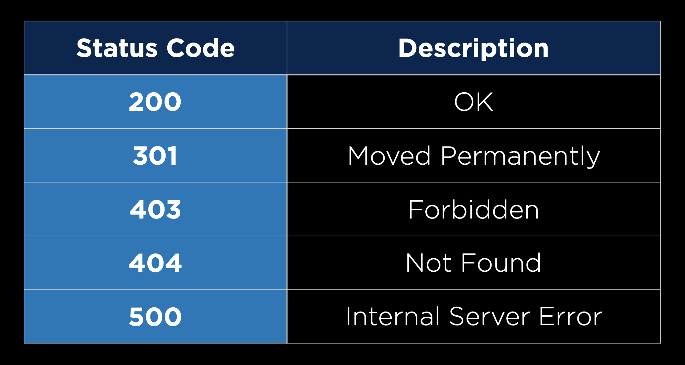

## Django

[Django](https://www.djangoproject.com/) is a Python-based web framework that will allow us to write Python code that dynamically generates HTML and CSS. The advantage to using a framework like Django is that a lot of code is already written for us that we can take advantage of.

  - To get started, we’ll have to install Django, which means you’ll also have to [install pip](https://pip.pypa.io/en/stable/installing/) if you haven’t already done so.
  - Once you have Pip installed, you can run `pip3 install Django` in your terminal to install Django.

After installing Django, we can go through the steps of creating a new Django project:

  1. Run `django-admin startproject PROJECT_NAME` to create a number of starter files for our project.
  1. Run `cd PROJECT_NAME` to navigate into your new project’s directory.
  1. Open the directory in your text editor of choice. You’ll notice that some files have been created for you. We won’t need to look at most of these for now, but there are three that will be very important from the start:

                  - `manage.py` is what we use to execute commands on our terminal. We won’t have to edit it, but we’ll use it often.
                  - `settings.py` contains some important configuration settings for our new project. There are some default settings, but we may wish to change some of them from time to time.
                  - `urls.py` contains directions for where users should be routed after navigating to a certain URL.

  1. Start the project by running `python manage.py runserver`. This will open a development server, which you can access by visiting the URL provided. This development server is being run locally on your machine, meaning other people cannot access your website. This should bring you to a default landing page:
    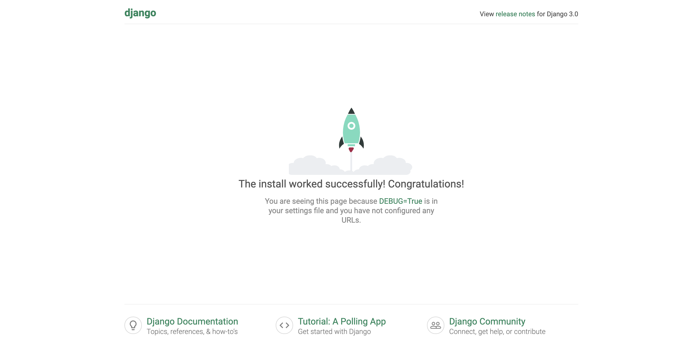
  1. Next, we’ll have to create an application. Django projects are split into one or more **applications**. Most of our projects will only require one application, but larger sites can make use of this ability to split a site into multiple apps. To create an application, we run `python manage.py startapp APP_NAME`. This will create some additional directories and files that will be useful shortly, including `views.py`.
  1. Now, we have to install our new app. To do this, we go to `settings.py`, scroll down to the list of `INSTALLED_APPS`, and add the name of our new application to this list.
    

## Routes

Now, in order to get started with our application:

  1. Next, we’ll navigate to `views.py`. This file will contain a number of different views, and we can think of a view for now as one page the user might like to see. To create our first view, we’ll write a function that takes in a `request`. For now, we’ll simply return an `HttpResponse` (A very simple response that includes a response code of 200 and a string of text that can be displayed in a web browser) of “Hello, World”. In order to do this, we have include `from django.http import HttpResponse`. Our file now looks like:

<pre class="highlight"><code>from django.shortcuts import render
from django.http import HttpResponse

# Create your views here.

def index(request):
    return HttpResponse("Hello, world!")
</code></pre>

  1. Now, we need to somehow associate this view we have just created with a specific URL. To do this, we’ll create another file called `urls.py` in the same directory as `views.py`. We already have a `urls.py` file for the whole project, but it is best to have a separate one for each individual app.
  1. Inside our new `urls.py`, we’ll create a list of url patterns that a user might visit while using our website. In order to do this:

                  1. We have to make some imports: `from django.urls import path` will give us the ability to reroute URLSs, and `from . import views` will import any functions we’ve created in `views.py`.
                  1. Create a list called `urlpatterns`
                  1. For each desired URL, add an item to the `urlpatterns` list that contains a call to the `path` function with two or three arguments: A string representing the URL path, a function from `views.py` that we wish to call when that URL is visited, and (optionally) a name for that path, in the format `name="something"`. For example, here’s what our simple app looks like now:

<pre class="highlight"><code>from django.urls import path
from . import views

urlpatterns = [
    path("", views.index, name="index")
]
</code></pre>

  1. Now, we’ve created a `urls.py` for this specific application, and it’s time to edit the `urls.py` created for us for the entire project. When you open this file, you should see that there’s already a path called `admin` which we’ll go over in later lectures. We want to add another path for our new app, so we’ll add an item to the `urlpatterns` list. This follows the same pattern as our earlier paths, except instead of adding a function from `views.py` as our second argument, we want to be able to include *all* of the paths from the `urls.py` file within our application. To do this, we write: `include("APP_NAME.urls")`, where `include` is a function we gain access to by also importing `include` from `django.urls` as shown in the `urls.py` below:

<pre class="highlight"><code>from django.contrib import admin
from django.urls import path, include

urlpatterns = [
    path('admin/', admin.site.urls),
    path('hello/', include("hello.urls"))
]
</code></pre>

  1. By doing this, we’ve specified that when a user visits our site, and then in the search bar adds `/hello` to the URL, they’ll be redirected to the paths inside of our new application.

Now, when I start my application using `python manage.py runserver` and visit the url provided, I’m met with this screen:
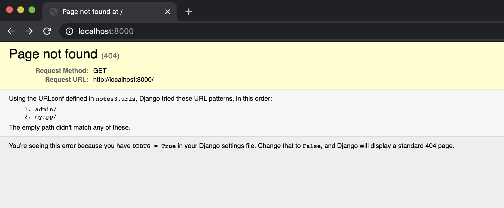
But this is because we have only defined the URL `localhost:8000/hello`, but we haven’t defined the URL `localhost:8000` with nothing added to the end. So, when I add `/hello` to the URL in my search bar:
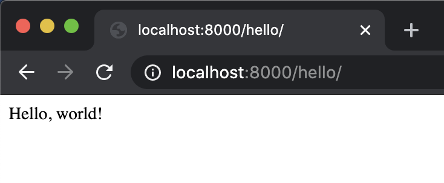
Now that we’ve had some success, let’s go over what just happened to get us to that point:

  1. When we accessed the URL `localhost:8000/hello/`, Django looked at what came after the base URL (`localhost:8000/`) and went to our project’s `urls.py` file and searched for a pattern that matched `hello`.
  1. It found that extension because we defined it, and saw that when met with that extension, it should `include` our `urls.py` file from within our application.
  1. Then, Django ignored the parts of the URL it has already used in rerouting (`localhost:8000/hello/`, or all of it) and looked inside our other `urls.py` file for a pattern that matches the remaining part of the URL.
  1. It found that our only path so far (`""`) matched what was left of the URL, and so it directed us to the function from `views.py` associated with that path.
  1. Finally, Django ran that function within `views.py`, and returned the result (`HttpResponse("Hello, world!")`) to our web browser.

Now, if we want to, we can change the `index` function within `views.py` to return anything we want it to! We could even keep track of variables and do calculations within the function before eventually returning something.

Now, let’s take a look at how we can add more than one view to our application. We can follow many of the same steps within our application to create pages that say hello to Brian and David.

Inside `views.py`:

<pre class="highlight"><code>from django.shortcuts import render
from django.http import HttpResponse

# Create your views here.

def index(request):
    return HttpResponse("Hello, world!")

def brian(request):
    return HttpResponse("Hello, Brian!")

def david(request):
    return HttpResponse("Hello, David!")
</code></pre>

Inside `urls.py` (within our application)

<pre class="highlight"><code>from django.urls import path
from . import views

urlpatterns = [
    path("", views.index, name="index"),
    path("brian", views.brian, name="brian"),
    path("david", views.david, name="david")
]
</code></pre>

Now, our site remains unchanged when we visit `localhost:8000/hello`, but we get different pages when we add `brian` or `david` to the URL:
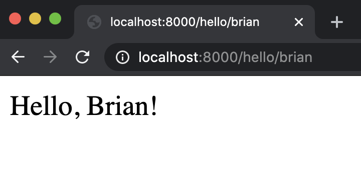
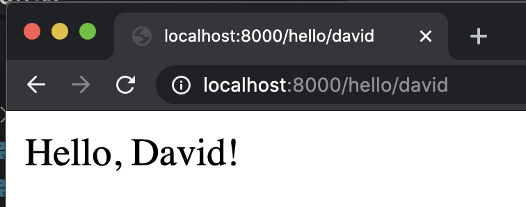

Many sites are parameterized by items included in the URL. For example, going to [www.twitter.com/cs50](https://twitter.com/cs50) will show you all of CS50’s tweets, and going to [www.github.com/cs50](https://github.com/cs50) will bring you to CS50’s GitHub page. You can even find your own public GitHub repositories by navigating to `www.github.com/YOUR_USERNAME`!

In thinking about how this is implemented, it seems impossible that sites like GitHub and Twitter would have an individual URL path for each of its users, so let’s look into how we could make a path that’s a bit more flexible. We’ll start by adding a more general function, called `greet`, to `views.py`:

<pre class="highlight"><code>def greet(request, name):
    return HttpResponse(f"Hello, {name}!")
</code></pre>

This function takes in not only a request, but also an additional argument of a user’s name, and then returns a custom HTTP Response based on that name. Next, we have to create a more flexible path in `urls.py`, which could look somehting like this:

<pre class="highlight"><code>path("&lt;str:name&gt;", views.greet, name="greet")
</code></pre>

This is some new syntax, but essentially what’s going on here is we’re no longer looking for a specific word or name in the URL, but any string that a user might enter. Now, we can try the site out with a few other URLs:
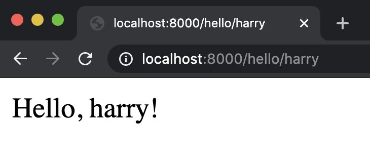
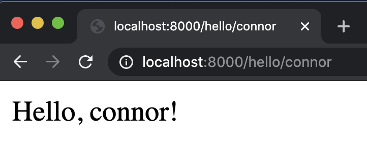

I can even make these look a little bit nicer, by augmenting the `greet` function to utilize Python’s `capitalize` function that capitalizes a string:

<pre class="highlight"><code>def greet(request, name):
    return HttpResponse(f"Hello, {name.capitalize()}!")
</code></pre>

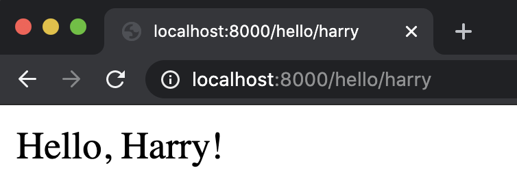

This is a great illustration of how any functionality we have in Python can be used in Django before being returned.

## Templates

So far, our HTTP Responses, have been only text, but we can include any HTML elements we want to! For example, I could decide to return a blue header instead of just the text in our `index` function:

<pre class="highlight"><code>def index(request):
    return HttpResponse("&lt;h1 style=\"color:blue\"&gt;Hello, world!&lt;/h1&gt;")
</code></pre>

It would get very tedious to write an entire HTML page within `views.py`. It would also constitute bad design, as we want to keep separate parts of our project in separate files whenever possible.

This is why we’ll now introduce [Django’s templates](https://docs.djangoproject.com/en/3.0/topics/templates/), which will allow us to write HTML and CSS in separate files and render those files using Django. The syntax we’ll use for rendering a template looks like this:

<pre class="highlight"><code>def index(request):
    return render(request, "hello/index.html")
</code></pre>

Now, we’ll need to create that template. To do this, we’ll create a folder called `templates` inside our app, then create a folder called `hello` (or whatever our app’s name is) within that, and then add a file called `index.html`.
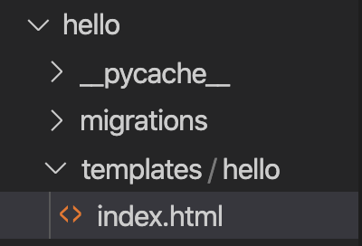
Next, we’ll add whatever we want to that new file:

<pre class="highlight"><code>&lt;!DOCTYPE html&gt;
&lt;html lang="en"&gt;
    &lt;head&gt;
        &lt;title&gt;Hello&lt;/title&gt;
    &lt;/head&gt;
    &lt;body&gt;
        &lt;h1&gt;Hello, World!&lt;/h1&gt;
    &lt;/body&gt;
&lt;/html&gt;
</code></pre>

Now, when we visit the main page of our application, we can see the header and title have been updated:

In addition to writing some static HTML pages, we can also use [Django’s templating language](https://docs.djangoproject.com/en/3.0/ref/templates/language/) to change the content of our HTML files based on the URL visited. Let’s try it out by changing our `greet` function from earlier:

<pre class="highlight"><code>def greet(request, name):
    return render(request, "hello/greet.html", {
        "name": name.capitalize()
    })
</code></pre>

Notice that we passed a third argument into the `render` function here, one that is known as the **context**. In this context, we can provide information that we would like to have available within our HTML files. This context takes the form of a Python dictionary. Now, we can create a `greet.html` file:

<pre class="highlight"><code>&lt;!DOCTYPE html&gt;
&lt;html lang="en"&gt;
    &lt;head&gt;
        &lt;title&gt;Hello&lt;/title&gt;
    &lt;/head&gt;
    &lt;body&gt;
        &lt;h1&gt;Hello, {{ name }}!&lt;/h1&gt;
    &lt;/body&gt;
&lt;/html&gt;
</code></pre>

You’ll noticed that we used some new syntax: double curly brackets. This syntax allows us to access variables that we’ve provided in the `context` argument. Now, when we try it out:

Now, we’ve seen how we can modify our HTML templates based on the context we provide. However, the Django templating language is even more powerful than that, so let’s take a look at a few other ways it can be helpful:

### Conditionals:

We may want to change what is displayed on our website depending on some conditions. For example, if you visit the site [www.isitchristmas.com](https://www.isitchristmas.com), you’ll probably be met with a page that looks like this:
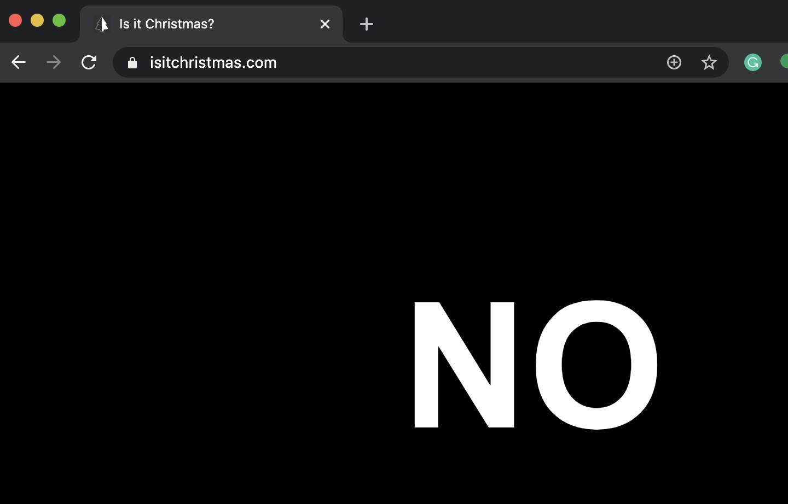
But this website will change on Christmas day, when the website will say **YES**. To make something like this for ourselves, let’s try creating a similar application, where we check whether or not it is New Year’s Day. Let’s create a new app to do so, recalling our process for creating a new app:

  1. run `python manage.py startapp newyear` in the terminal.
  1. Edit `settings.py`, adding “newyear” as one of our `INSTALLED_APPS`
  1. Edit our project’s `urls.py` file, and include a path similar to the one we created for the `hello` app:

<pre class="highlight"><code>path('newyear/', include("newyear.urls"))
</code></pre>

  1. Create another `urls.py` file within our new app’s directory, and update it to include a path similar to the index path in `hello`:

<pre class="highlight"><code>from django.urls import path
from . import views

urlpatterns = [
    path("", views.index, name="index"),
]
</code></pre>

  1. Create an index function in `views.py`.

Now that we’re set up with our new app, let’s figure out how to check whether or not it’s New Year’s Day. To do this, we can import Python’s [datetime](https://docs.python.org/3/library/datetime.html) module. To get a sense for how this module works, we can look at the [documentation](https://docs.python.org/3/library/datetime.html), and then test it outside of Django using the Python interpreter.

  - The **Python interpreter** is a tool we can use to test out small chunks of Python code. To use this, run `python` in your terminal, and then you’ll be able to type and run Python code within your terminal. When you’re done using the interpreter, run `exit()` to leave.
    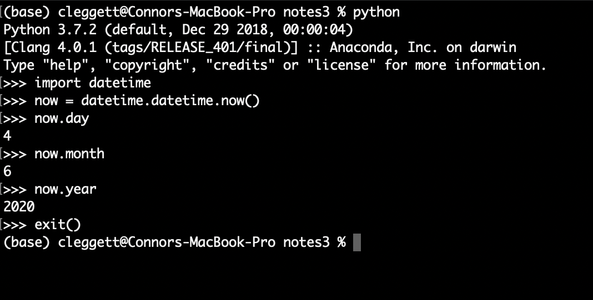
  - We can use this knowledge to construct a boolean expression that will evaluate to True if and only if today is New Year’s Day: `now.day == 1 and now.month == 1`
  - Now that we have an expression we can use to evaluate whether or not it’s New Year’s Day, we can update our index function in `views.py`:

<pre class="highlight"><code>def index(request):
    now = datetime.datetime.now()
    return render(request, "newyear/index.html", {
        "newyear": now.month == 1 and now.day == 1
    })
</code></pre>

Now, let’s create our `index.html` template. We’ll have to again create a new folder called `templates`, a folder within that called `newyear`, and a file within that called `index.html`. Inside that file, we’ll write something like this:

<pre class="highlight"><code>&lt;!DOCTYPE html&gt;
&lt;html lang="en"&gt;
    &lt;head&gt;
        &lt;title&gt;Is it New Year's?&lt;/title&gt;
    &lt;/head&gt;
    &lt;body&gt;
        
            &lt;h1&gt;YES&lt;/h1&gt;
        
            &lt;h1&gt;NO&lt;/h1&gt;
        
    &lt;/body&gt;
&lt;/html&gt;
</code></pre>

In the code above, notice that when we wish to include logic in our HTML files, we use `` as opening and closing tags around logical statements. Also note that Django’s formatting language requires you to include an ending tag indicating that we are done with our `if-else` block. Now, we can open up to our page to see:
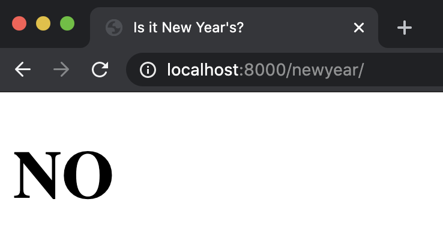
Now, to get a better idea of what’s going on behind the scenes, let’s inspect the element of this page:
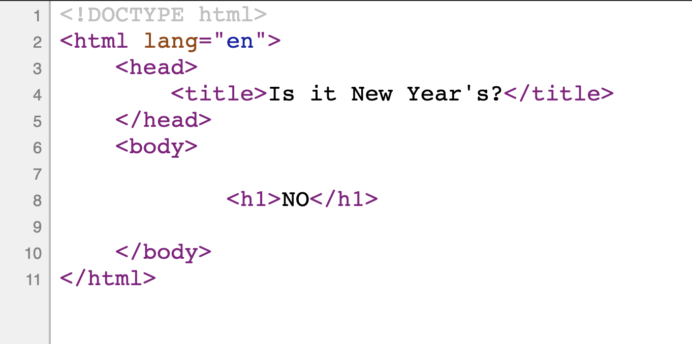
Notice that the HTML that is actually being sent to your web browser includes only the NO header, meaning that Django is using the HTML template we wrote to create a new HTML file, and then sending it to our web browser. If we cheat a little bit and make sure that our condition is always true, we see that the opposite case is filled:

<pre class="highlight"><code>def index(request):
    now = datetime.datetime.now()
    return render(request, "newyear/index.html", {
        "newyear": True
    })
</code></pre>

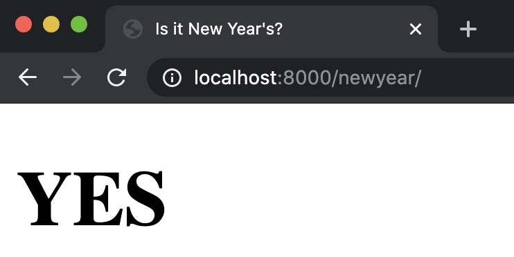
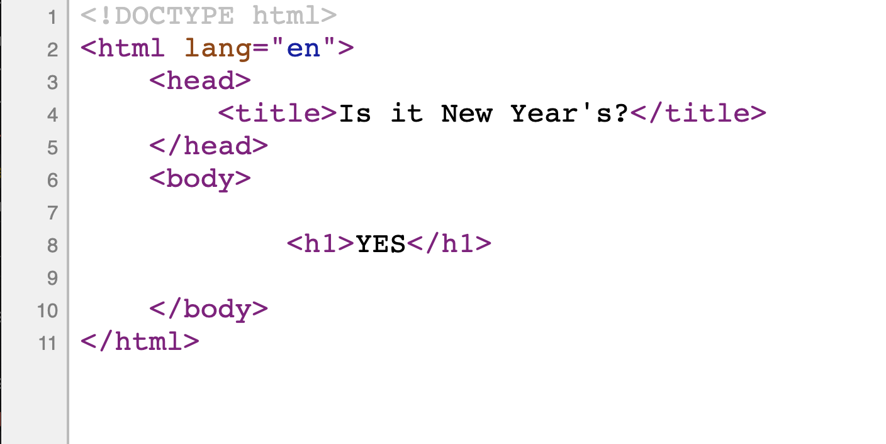

### Styling

If we want to add a CSS file, which is a *static* file because it doesn’t change, we’ll first create a folder called `static`, then create a `newyear` folder within that, and then a `styles.css` file within that. In this file, we can add any styling we wish just as we did in the first lecture:

<pre class="highlight"><code>h1 {
    font-family: sans-serif;
    font-size: 90px;
    text-align: center;
}
</code></pre>

Now, to include this styling in our HTML file, we add the line `{load static}` to the top of our HTML template, which signals to Django that we wish to have access to the files in our `static` folder. Then, rather than hard-coding the link to a stylesheet as we did before, we’ll use some Django-specific syntax:

<pre class="highlight"><code>&lt;link rel="stylesheet" href=""&gt;
</code></pre>

Now, if we restart the server, we can see that the styling changes were in fact applied:

## Tasks

Now, let’s take what we’ve learned so far and apply it to a mini-project: creating a TODO list.
Let’s start by, once again, creating a new app:

  1. run `python manage.py startapp tasks` in the terminal.
  1. Edit `settings.py`, adding “tasks” as one of our `INSTALLED_APPS`
  1. Edit our project’s `urls.py` file, and include a path similar to the one we created for the `hello` app:

<pre class="highlight"><code>path('tasks/', include("tasks.urls"))
</code></pre>

  1. Create another `urls.py` file within our new app’s directory, and update it to include a path similar to the index path in `hello`:

<pre class="highlight"><code>from django.urls import path
from . import views

urlpatterns = [
    path("", views.index, name="index"),
]
</code></pre>

  1. Create an index function in `views.py`.

Now, let’s begin by attempting to simply create a list of tasks and then display them to a page. Let’s create a Python list at the top of `views.py` where we’ll store our tasks. Then, we can update our `index` function to render a template, and provide our newly-created list as context.

<pre class="highlight"><code>from django.shortcuts import render

tasks = ["foo", "bar", "baz"]

# Create your views here.
def index(request):
    return render(request, "tasks/index.html", {
        "tasks": tasks
    })
</code></pre>

Now, let’s work on creating our template HTML file:

<pre class="highlight"><code>&lt;!DOCTYPE html&gt;
&lt;html lang="en"&gt;
    &lt;head&gt;
        &lt;title&gt;Tasks&lt;/title&gt;
    &lt;/head&gt;
    &lt;body&gt;
        &lt;ul&gt;
            
                &lt;li&gt;{{ task }}&lt;/li&gt;
            
        &lt;/ul&gt;
    &lt;/body&gt;
&lt;/html&gt;
</code></pre>

Notice here that we are able to loop over our tasks using syntax similar to our conditionals from earlier, and also similar to a Python loop from Lecture 2. When we go to the tasks page now, we can see our list being rendered:
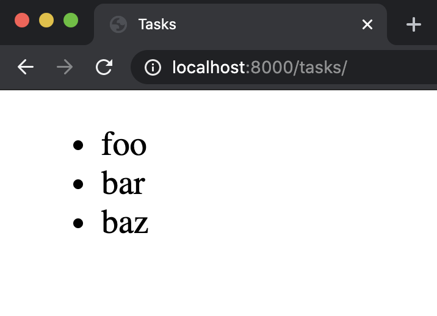

## Forms

Now that we can see all of our current tasks as a list, we may want to be able to add some new tasks. To do this we’ll start taking a look at using forms to update a web page. Let’s begin by adding another function to `views.py` that will render a page with a form for adding a new task:

<pre class="highlight"><code># Add a new task:
def add(request):
    return render(request, "tasks/add.html")
</code></pre>

Next, make sure to add another path to `urls.py`:

<pre class="highlight"><code>path("add", views.add, name="add")
</code></pre>

Now, we’ll create our `add.html` file, which is fairly similar to `index.html`, except that in the body we’ll include a form rather than a list:

<pre class="highlight"><code>&lt;!DOCTYPE html&gt;
&lt;html lang="en"&gt;
    &lt;head&gt;
        &lt;title&gt;Tasks&lt;/title&gt;
    &lt;/head&gt;
    &lt;body&gt;
        &lt;h1&gt;Add Task:&lt;/h1&gt;
        &lt;form action=""&gt;
            &lt;input type="text", name="task"&gt;
            &lt;input type="submit"&gt;
        &lt;/form&gt;
    &lt;/body&gt;
&lt;/html&gt;
</code></pre>

However, what we’ve just done isn’t necessarily the best design, as we’ve just repeated the bulk of that HTML in two different files. Django’s templating language gives us a way to eliminate this poor design: [template inheritance](https://tutorial.djangogirls.org/en/template_extending/). This allows us to create a `layout.html` file that will contain the general structure of our page:

<pre class="highlight"><code>&lt;!DOCTYPE html&gt;
&lt;html lang="en"&gt;
    &lt;head&gt;
        &lt;title&gt;Tasks&lt;/title&gt;
    &lt;/head&gt;
    &lt;body&gt;
        
        
    &lt;/body&gt;
&lt;/html&gt;
</code></pre>

Notice that we’ve again used `` to denote some sort of non-HTML logic, and in this case, we’re telling Django to fill this “block” with some text from another file. Now, we can alter our other two HTML files to look like:

`index.html`:

<pre class="highlight"><code>


    &lt;h1&gt;Tasks:&lt;/h1&gt;
    &lt;ul&gt;
        
            &lt;li&gt;{{ task }}&lt;/li&gt;
        
    &lt;/ul&gt;

</code></pre>

`add.html`:

<pre class="highlight"><code>


    &lt;h1&gt;Add Task:&lt;/h1&gt;
    &lt;form action=""&gt;
        &lt;input type="text", name="task"&gt;
        &lt;input type="submit"&gt;
    &lt;/form&gt;

</code></pre>

Notice how we can now get rid of much of the repeated code by *extending* our layout file. Now, our index page remains the same, and we now have an add page as well:
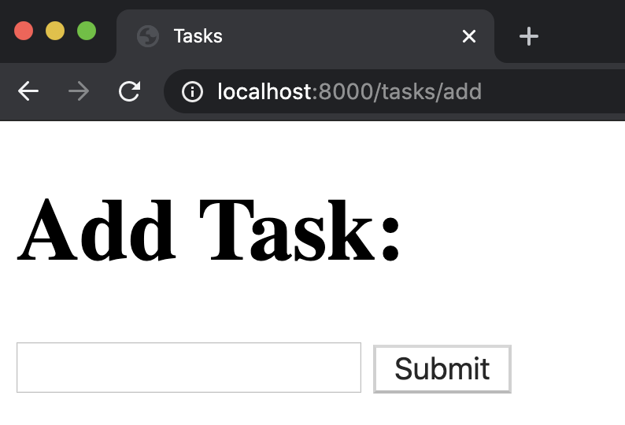
Next, it’s not ideal to have to type “/add” in the URL any time we want to add a new task, so we’ll probably want to add some links between pages. Instead of hard-coding links though, we can now use the `name` variable we assigned to each path in `urls.py`, and create a link that looks like this:

<pre class="highlight"><code>&lt;a href=""&gt;Add a New Task&lt;/a&gt;
</code></pre>

where ‘add’ is the name of that path. We can do a similar thing in our `add.html`:

<pre class="highlight"><code>&lt;a href=""&gt;View Tasks&lt;/a&gt;
</code></pre>

This could potentially create a problem though, as we have a few routes named `index` throughout our different apps. We can solve this by going into each of our app’s `urls.py` file, and adding an `app_name` variable, so that the files now look something like this:

<pre class="highlight"><code>from django.urls import path
from . import views

app_name = "tasks"
urlpatterns = [
    path("", views.index, name="index"),
    path("add", views.add, name="add")
]
</code></pre>

We can then change our links from simply `index` and `add` to `tasks:index` and `tasks:add`

<pre class="highlight"><code>&lt;a href=""&gt;View Tasks&lt;/a&gt;

&lt;a href=""&gt;Add a New Task&lt;/a&gt;
</code></pre>

Now, let’s work on making sure the form actually does something when the user submits it. We can do this by adding an `action` to the form we have created in `add.html`:

<pre class="highlight"><code>&lt;form action="" method="post"&gt;
</code></pre>

This means that once the form is submitted, we will be routed back to the `add` URL. Here we’ve specified that we’ll be using a *post* method rather than a *get* method, which is typically what we’ll use any time a form could alter the state of that web page.

We need to add a bit more to this form now, because Django requires a token to prevent [Cross-Site Request Forgery (CSRF) Attack](https://portswigger.net/web-security/csrf). This is an attack where a malicious user attempts to send a request to your server from somewhere other than your site. This could be a really big problem for some websites. Say, for example, that a banking website has a form for one user to transfer money to another one. It would be catastrophic if someone could submit a transfer from outside of the bank’s website!

To solve this problem, when Django sends a response rendering a template, it also provides a **CSRF token** that is unique with each new session on the site. Then, when a request is submitted, Django checks to make sure the CSRF token associated with the request matches one that it has recently provided. Therefore, if a malicious user on another site attempted to submit a request, they would be blocked due to an invalid CSRF token. This CSRF validation is built into the [Django Middleware](https://docs.djangoproject.com/en/3.0/topics/http/middleware/) framework, which can intervene in the request-response processing of a Django app. We won’t go into any more detail about Middleware in this course, but do look at the [documentation](https://docs.djangoproject.com/en/3.0/topics/http/middleware/) if interested!

To incorporate this technology into our code, we must add a line to our form in `add.html`.

<pre class="highlight"><code>&lt;form action="" method="post"&gt;
    
    &lt;input type="text", name="task"&gt;
    &lt;input type="submit"&gt;
&lt;/form&gt;
</code></pre>

This line adds a hidden input field with the CSRF token provided by Django, such that when we reload the page, it looks as though nothing has changed. However, if we inspect element, we’ll notice that a new input field has been added:

### Django Forms

While we can create forms by writing raw HTML as we’ve just done, Django provides an even easier way to collect information from a user: [Django Forms](https://docs.djangoproject.com/en/3.0/ref/forms/api/). In order to use this method, we’ll add the following to the top of `views.py` to import the `forms` module:

<pre class="highlight"><code>from django import forms
</code></pre>

Now, we can create a new form within `views.py` by creating a Python class called `NewTaskForm`:

<pre class="highlight"><code>class NewTaskForm(forms.Form):
    task = forms.CharField(label="New Task")
</code></pre>

Now, let’s go through what’s going on in that class:

  - Inside the parentheses after `NewTaskForm`, we see that we have `forms.Form`. This is because our new form [inherits](https://www.w3schools.com/python/python_inheritance.asp) from a class called `Form` that is included in the `forms` module. We’ve already seen how inheritance can be used in Django’s templating language and for styling using Sass. This is another example of how inheritance is used to take a more general description (the `forms.Form` class) and narrow it down to what we want (our new Form). Inheritance is a key part of Object Oriented Programming that we won’t discuss in detail during this course, but there are [many online resources](https://www.w3schools.com/python/python_inheritance.asp) available to learn about the topic!
  - Inside this class, we can specify what information we would like to collect from the user, in this case the name of a task.
  - We specify that this should be a textual input by writing `forms.CharField`, but there are [many other input fields](https://docs.djangoproject.com/en/3.0/ref/forms/fields/#built-in-field-classes) included in Django’s form module that we can choose from.
  - Within this `CharField`, we specify a `label`, which will appear to the user when they load the page. A `label` is just one of [many arguments](https://docs.djangoproject.com/en/3.0/ref/forms/fields/#core-field-arguments) we can pass into a form field.

Now that we’ve created a `NewTaskForm` class, we can include it in the context while rendering the `add` page:

<pre class="highlight"><code># Add a new task:
def add(request):
    return render(request, "tasks/add.html", {
        "form": NewTaskForm()
    })
</code></pre>

Now, within `add.html`, we can replace our input field with the form we just created:

<pre class="highlight"><code>


    &lt;h1&gt;Add Task:&lt;/h1&gt;
    &lt;form action="" method="post"&gt;
        
        {{ form }}
        &lt;input type="submit"&gt;
    &lt;/form&gt;
    &lt;a href=""&gt;View Tasks&lt;/a&gt;

</code></pre>

There are several advantages to using the `forms` module rather than manually writing an HTML form:

  - If we want to add new fields to the form, we can simply add them in `views.py` without typing additional HTML.
  - Django automatically performs [client-side validation](https://developer.mozilla.org/en-US/docs/Learn/Forms/Form_validation), or validation local to the user’s machine. meaning it will not allow a user to submit their form if it is incomplete.
  - Django provides simple [server-side validation](https://developer.mozilla.org/en-US/docs/Learn/Forms/Form_validation), or validation that occurs once form data has reached the server.
  - In the next lecture, we’ll begin using **models** to store information, and Django makes it very simple to create a form based on a model.

Now that we have a form set up, let’s work on what happens when a user clicks the submit button. When a user navigates to the add page by clicking a link or typing in the URL, they submit a `GET` request to the server, which we’ve already handled in our `add` function. When a user submits a form though, they send a `POST` request to the server, which at the moment is not handled in the `add` function. We can handle a `POST` method by adding a condition based on the `request` argument our function takes in. The comments in the code below explain the purpose of each line:

<pre class="highlight"><code># Add a new task:
def add(request):

    # Check if method is POST
    if request.method == "POST":

        # Take in the data the user submitted and save it as form
        form = NewTaskForm(request.POST)

        # Check if form data is valid (server-side)
        if form.is_valid():

            # Isolate the task from the 'cleaned' version of form data
            task = form.cleaned_data["task"]

            # Add the new task to our list of tasks
            tasks.append(task)

            # Redirect user to list of tasks
            return HttpResponseRedirect(reverse("tasks:index"))

        else:

            # If the form is invalid, re-render the page with existing information.
            return render(request, "tasks/add.html", {
                "form": form
            })

    return render(request, "tasks/add.html", {
        "form": NewTaskForm()
    })
</code></pre>

A quick note: in order to redirect the user after a successful submission, we need a few more imports:

<pre class="highlight"><code>from django.urls import reverse
from django.http import HttpResponseRedirect
</code></pre>

## Sessions

<dl>
  <dt>At this point, we’ve successfully built an application that allows us to add tasks to a growing list. However, it may be a problem that we store these tasks as a global variable, as it means that all of the users who visit the page see the exact same list. In order to solve this problem we’re going to employ a tool known as <a href="https://docs.djangoproject.com/en/3.0/topics/http/sessions/">sessions.</a></dt>
  <dd>
    
Sessions are a way to store unique data on the server side for each new visit to a website.

  </dd>
</dl>

To use sessions in our application, we’ll first delete our global `tasks` variable, then alter our `index` function, and finally make sure that anywhere else we had used the variable `tasks`, we replace it with `request.session["tasks"]`

<pre class="highlight"><code>def index(request):

    # Check if there already exists a "tasks" key in our session

    if "tasks" not in request.session:

        # If not, create a new list
        request.session["tasks"] = []

    return render(request, "tasks/index.html", {
        "tasks": request.session["tasks"]
    })

# Add a new task:
def add(request):
    if request.method == "POST":

        # Take in the data the user submitted and save it as form
        form = NewTaskForm(request.POST)

        # Check if form data is valid (server-side)
        if form.is_valid():

            # Isolate the task from the 'cleaned' version of form data
            task = form.cleaned_data["task"]

            # Add the new task to our list of tasks
            request.session["tasks"] += [task]

            # Redirect user to list of tasks
            return HttpResponseRedirect(reverse("tasks:index"))
        else:

            # If the form is invalid, re-render the page with existing information.
            return render(request, "tasks/add.html", {
                "form": form
            })

    return render(request, "tasks/add.html", {
        "form": NewTaskForm()
    })
</code></pre>

Finally, before Django will be able to store this data, we must run `python manage.py migrate` in the terminal. Next week we’ll talk more about what a migration is, but for now just know that the above command allows us to store sessions.

That’s all for this lecture! Next time we’ll be working on using Django to store, access, and manipulate data.

                </main>

            

        

