        

            

                <aside class="col-md">

                    <header>
# [CS50’s Web Programming with Python and JavaScript](../..)

OpenCourseWare

[Brian Yu](https://brianyu.me)  
&#10;[brian@cs.harvard.edu](mailto:brian@cs.harvard.edu)

[David J. Malan](https://cs.harvard.edu/malan/)  
&#10;[malan@harvard.edu](mailto:malan@harvard.edu)  
&#10;[<i class="fab fa-facebook-f"></i>](https://www.facebook.com/dmalan)[<i class="fab fa-github"></i>](https://github.com/dmalan)[<i class="fab fa-instagram"></i>](https://www.instagram.com/davidjmalan/)[<i class="fab fa-linkedin"></i>](https://www.linkedin.com/in/malan/)[<i class="fab fa-quora"></i>](https://www.quora.com/profile/David-J-Malan)[<i class="fab fa-reddit-alien"></i>](https://www.reddit.com/user/davidjmalan)[<i class="fab fa-twitter"></i>](https://twitter.com/davidjmalan)

</header>

                    <button aria-controls="nav" aria-expanded="false" class="btn btn-sm collapsed d-md-none" data-target="aside > nav" data-toggle="collapse">
                        Menu
                    </button>

                    <nav class="collapse d-md-block" id="nav">
- - -

1. [HTML, CSS](../../weeks/0/)

1. [Git](../../weeks/1/)

1. [Python](../../weeks/2/)

1. [Django](../../weeks/3/)

1. [SQL, Models, and Migrations](../../weeks/4/)

1. [JavaScript](../../weeks/5/)

1. [User Interfaces](../../weeks/6/)

1. [Testing, CI/CD](../../weeks/7/)

1. [Scalability and Security](../../weeks/8/)

- - -

- [CS50 Certificate](../../certificate/)

- [FAQs](../../faqs/)

- - -

- [Ed Discussion](https://cs50.harvard.edu/web/ed) for Q&amp;A

- [Quick Start Guide](https://us.edstem.org/quickstart/ed-discussion.pdf)

- - -

- [edX](https://cs50.edx.org/web)

- [iTunes U](https://itunes.apple.com/us/course/id1505432709)

- [YouTube](https://www.youtube.com/playlist?list=PLhQjrBD2T380xvFSUmToMMzERZ3qB5Ueu)

- - -

- [Changelog](https://cs50.noticeable.io/)

- [Status Page](https://cs50.statuspage.io/)

- - -

-

    [Communities](../../communities/)

- [Discord](https://discord.gg/cs50)

- [Facebook Group](https://www.facebook.com/groups/cs50/)

- [Facebook Page](https://www.facebook.com/cs50/)

- [GitHub](https://github.com/cs50)

- [Gitter](https://gitter.im/cs50/x)

- [Instagram](https://instagram.com/cs50)

- [LinkedIn Group](https://www.linkedin.com/groups/7437240/)

- [LinkedIn Page](https://www.linkedin.com/school/CS50/)

- [Quora](https://www.quora.com/topic/CS50)

- [Slack](https://cs50.edx.org/slack)

- [Snapchat](https://www.snapchat.com/add/cs50)

- [Twitter](https://twitter.com/cs50)

- [YouTube](http://www.youtube.com/subscription_center?add_user=cs50tv)

- - -

- - -

[<i class="fab fa-creative-commons mr-1"></i>License](../../license/)

</nav>

                    <footer></footer>

                </aside>

                <main class="col-md markdown-body">

                    # Lecture 4

  - [Introduction](#introduction)
  - [SQL](#sql)    
                  - [Databases](#databases)
                  - [Column Types](#column-types)

  - [Tables](#tables)
  - [SELECT](#select)    
                  - [Working with SQL in the Terminal](#working-with-sql-in-the-terminal)
                  - [Functions](#functions)
                  - [UPDATE](#update)
                  - [DELETE](#delete)
                  - [Other Clauses](#other-clauses)

  - [Joining Tables](#joining-tables)    
                  - [JOIN Query](#join-query)
                  - [Indexing:](#indexing)
                  - [SQL Vulnerabilities](#sql-vulnerabilities)

  - [Django Models](#django-models)
  - [Migrations](#migrations)
  - [Shell](#shell)    
                  - [Starting our application](#starting-our-application)

  - [Django Admin](#django-admin)
  - [Many-to-Many Relationships](#many-to-many-relationships)
  - [Users](#users)

## Introduction

  - So far, we’ve discussed how to build simple web pages using HTML and CSS, and how to use Git and GitHub in order to keep track of changes to our code and collaborate with others. We also familiarized ourselves with the Python programming language, and started using Django to create web applications.
  - Today, we’ll learn about using SQL and Django models to efficiently store and access data.

## SQL

: [SQL](https://www.w3schools.com/sql/), or Structured Query Language, is a programming language that allows us to update and query databases.

### Databases

Before we get into how to use the SQL language, we should discuss how our data is stored. When using SQL, we’ll work with a [relational database](https://www.oracle.com/database/what-is-a-relational-database/#:~:text=A%20relational%20database%20is%20a,of%20representing%20data%20in%20tables.) where we can find all of our data stored in a number of [tables](https://www.essentialsql.com/what-is-a-database-table/). Each of these tables is made up of a set number of columns and a flexible number of rows.

To illustrate how to work with SQL, we’ll use the example of a website for an airline used to keep track of flights and passengers. In the following table, we see that we’re keeping track of a number of flights, each of which has an `origin`, a `destination`, and a `duration`.

There are several different relational database management systems that are commonly used to store information, and that can easily interact with SQL commands:

  - [MySQL](https://www.mysql.com/)
  - [PostgreSQL](https://www.postgresql.org/)
  - [SQLite](https://www.sqlite.org/index.html)
  - …

The first two, MySQL and PostgreSQL, are heavier-duty database management systems that are typically run on servers separate from those running a website. SQLite, on the other hand, is a lighter-weight system that can store all of its data in a single file. We’ll be using SQLite throughout this course, as it is the default system used by Django.

### Column Types

Just as we worked with several different variable types in Python, SQLite has [types](https://www.sqlite.org/datatype3.html) that represent different forms of information. Other management systems may have different data types, but all are fairly similar to those of SQLite:

  - `TEXT`: For strings of text (Ex. a person’s name)
  - `NUMERIC`: A more general form of numeric data (Ex. A date or boolean value)
  - `INTEGER`: Any non-decimal number (Ex. a person’s age)
  - `REAL`: Any real number (Ex. a person’s weight)
  - `BLOB` (Binary Large Object): Any other binary data that we may want to store in our database (Ex. an image)

## Tables

Now, to actually get started with using SQL to interact with a database, let’s begin by creating a new table. The [command to create a new table](https://www.w3schools.com/sql/sql_create_table.asp) looks something like this:

<pre class="highlight"><code>CREATE TABLE flights(
    id INTEGER PRIMARY KEY AUTOINCREMENT,
    origin TEXT NOT NULL,
    destination TEXT NOT NULL,
    duration INTEGER NOT NULL
);
</code></pre>

In the above command, we’re creating a new table that we’ve decided to call `flights`, and we’ve added four columns to this table:

  1. `id`: It is often helpful to have an number that allows us to uniquely identify each row in a table. Here we have specified that `id` is an integer, and also that it is our [primary key](https://www.w3schools.com/sql/sql_primarykey.ASP), meaning it is our unique identifier. We have additionally specified that it will `AUTOINCREMENT`, which means we will not have to provide an id every time we add to the table because it will be done automatically.
  1. `origin`: Here we’ve specified that this will be a text field, and by writing `NOT NULL` we have required that it have a value.
  1. `destination`: Again we’ve specified that this will be a text field and prevented it from being null.
  1. `duration`: Again this value cannot be null, but this time it is represented by an integer rather than as text.

We just saw the `NOT NULL` and `PRIMARY KEY` constraint when making a column, but there are several other [constraints](https://www.tutorialspoint.com/sqlite/sqlite_constraints.htm) available to us:

  - `CHECK`: Makes sure certain constraints are met before allowing a row to be added/modified
  - `DEFAULT`: Provides a default value if no value is given
  - `NOT NULL`: Makes sure a value is provided
  - `PRIMARY KEY`: Indicates this is the primary way of searching for a row in the database
  - `UNIQUE`: Ensures that no two rows have the same value in that column.
  - …

Now that we’ve seen how to create a table, let’s look at how we can add rows to it. In SQL, we do this using the `INSERT` command:

<pre class="highlight"><code>INSERT INTO flights
    (origin, destination, duration)
    VALUES ("New York", "London", 415);
</code></pre>

In the above command, we’ve specified the table name we wish to insert into, then provided a list of the column names we will be providing information on, and then specified the `VALUES` we would like to fill that row in the table, making sure the `VALUES` come in the same order as our corresponding list of columns. Note that we don’t need to provide a value for `id` because it is automatically incrementing.

## SELECT

Once a table has been populated with some rows, we’ll probably want a way to access data within that table. We do this using SQL’s [SELECT](https://www.w3schools.com/sql/sql_select.asp) query. The simplest `SELECT` query into our flights table might look something like this:

<pre class="highlight"><code>SELECT * FROM flights;
</code></pre>

The above command (*) retrieves all of the data from our flights table

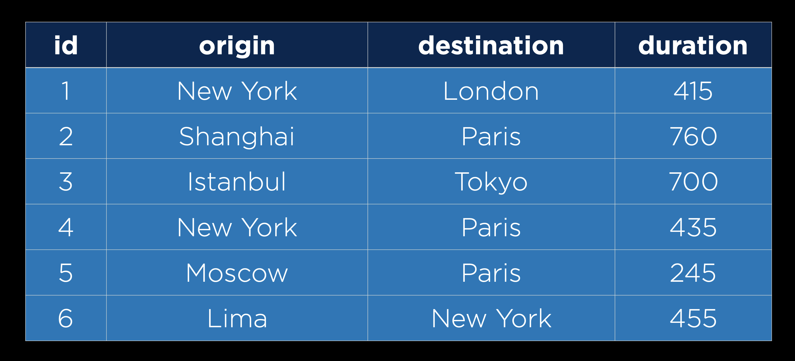

It may be the case though that we don’t really need all of the columns from the database, just origin and destination. To access just these columns, we can replace the * with the column names we would like access to. The following query returns all of the origins and destinations.

<pre class="highlight"><code>SELECT origin, destination FROM flights;
</code></pre>

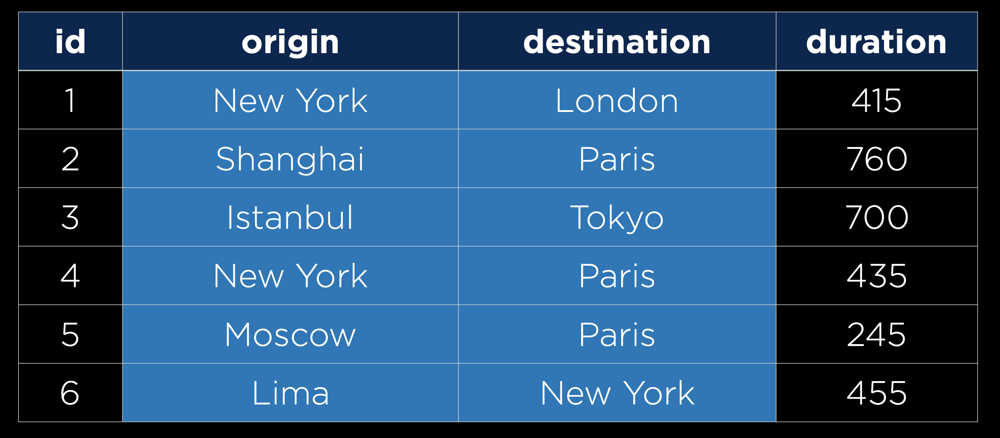

As our tables get larger and larger, we will also want to narrow down which rows our query returns. We do this by adding a [WHERE](https://www.w3schools.com/sql/sql_where.asp) followed by some condition. For example, the following command selects only row with an `id` of `3`:

<pre class="highlight"><code>SELECT * FROM flights WHERE id = 3;
</code></pre>

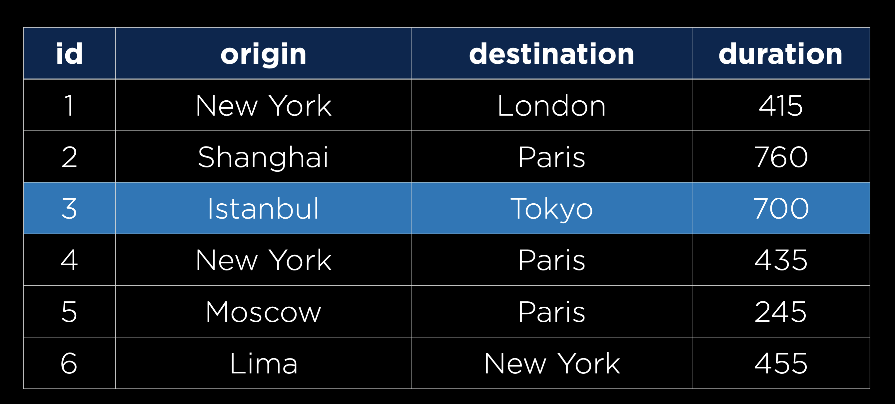

e can filter  by any column, not just `id`!

<pre class="highlight"><code>SELECT * FROM flights WHERE origin = "New York";
</code></pre>

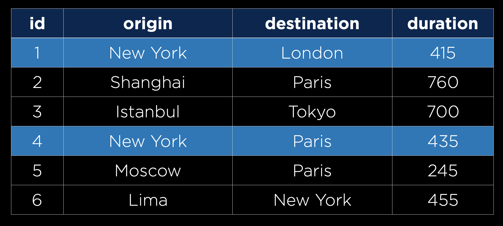

### Working with SQL in the Terminal

Now that we know some basic SQL commands, let’s test them out in the terminal! In order to work with SQLite on your computer, you must first [download SQLite](https://www.sqlite.org/download.html). (We won’t use it in lecture, but you can also [download DB Browser](https://sqlitebrowser.org/dl/) for a more user-friendly way to run SQL queries.)

We can start by creating a file for our database either by manually creating a new file, or running `touch flights.sql` in the terminal. Now, if we run `sqlite3 flights.sql` in the terminal, we’ll be brought to a SQLite prompt where we can run SQL commands:

<pre class="highlight"><code>
# Entering into the SQLite Prompt
(base) % sqlite3 flights.sql
SQLite version 3.26.0 2018-12-01 12:34:55
Enter ".help" for usage hints.

# Creating a new Table
sqlite&gt; CREATE TABLE flights(
   ...&gt;     id INTEGER PRIMARY KEY AUTOINCREMENT,
   ...&gt;     origin TEXT NOT NULL,
   ...&gt;     destination TEXT NOT NULL,
   ...&gt;     duration INTEGER NOT NULL
   ...&gt; );

# Listing all current tables (Just flights for now)
sqlite&gt; .tables
flights

# Querying for everything within flights (Which is now empty)
sqlite&gt; SELECT * FROM flights;

# Adding one flight
sqlite&gt; INSERT INTO flights
   ...&gt;     (origin, destination, duration)
   ...&gt;     VALUES ("New York", "London", 415);

# Checking for new information, which we can now see
sqlite&gt; SELECT * FROM flights;
1|New York|London|415

# Adding some more flights
sqlite&gt; INSERT INTO flights (origin, destination, duration) VALUES ("Shanghai", "Paris", 760);
sqlite&gt; INSERT INTO flights (origin, destination, duration) VALUES ("Istanbul", "Tokyo", 700);
sqlite&gt; INSERT INTO flights (origin, destination, duration) VALUES ("New York", "Paris", 435);
sqlite&gt; INSERT INTO flights (origin, destination, duration) VALUES ("Moscow", "Paris", 245);
sqlite&gt; INSERT INTO flights (origin, destination, duration) VALUES ("Lima", "New York", 455);

# Querying this new information
sqlite&gt; SELECT * FROM flights;
1|New York|London|415
2|Shanghai|Paris|760
3|Istanbul|Tokyo|700
4|New York|Paris|435
5|Moscow|Paris|245
6|Lima|New York|455

# Changing the settings to make output more readable
sqlite&gt; .mode columns
sqlite&gt; .headers yes

# Querying all information again
sqlite&gt; SELECT * FROM flights;
id          origin      destination  duration  
----------  ----------  -----------  ----------
1           New York    London       415       
2           Shanghai    Paris        760       
3           Istanbul    Tokyo        700       
4           New York    Paris        435       
5           Moscow      Paris        245       
6           Lima        New York     455    

# Searching for just those flights originating in New York   
sqlite&gt; SELECT * FROM flights WHERE origin = "New York";
id          origin      destination  duration  
----------  ----------  -----------  ----------
1           New York    London       415       
4           New York    Paris        435    
</code></pre>

We can also use more than just equality to filter out our flights. For integer and real values, we can use greater than or less than:

<pre class="highlight"><code>SELECT * FROM flights WHERE duration &gt; 500;
</code></pre>

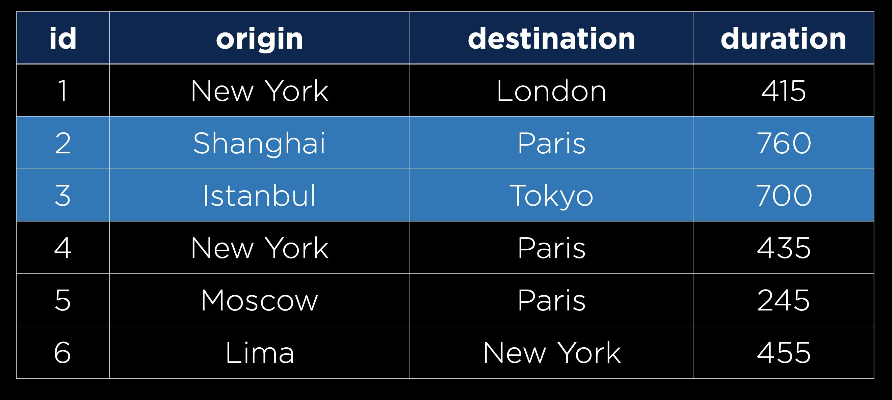

nd we can also use other logic ([AND, OR](https://www.w3schools.com/sql/sql_and_or.asp)) like in Python:

<pre class="highlight"><code>SELECT * FROM flights WHERE duration &gt; 500 AND destination = "Paris";
</code></pre>

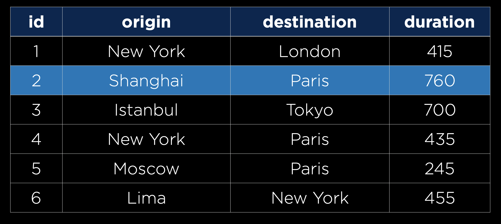

<pre class="highlight"><code>SELECT * FROM flights WHERE duration &gt; 500 OR destination = "Paris";
</code></pre>

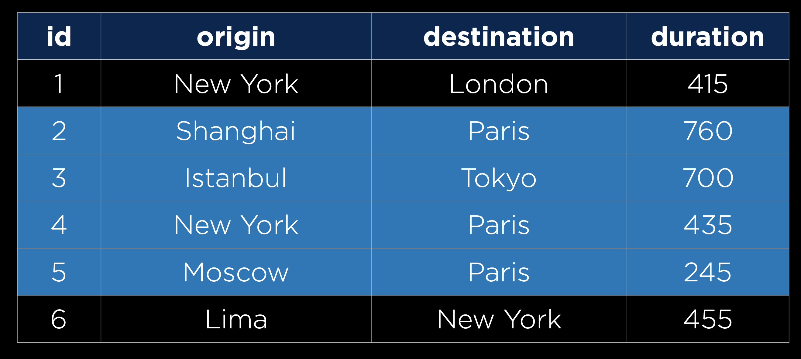

We can also use the keyword [IN](https://www.w3schools.com/sql/sql_in.asp) to see if a bit of data is one of several options:

<pre class="highlight"><code>SELECT * FROM flights WHERE origin IN ("New York", "Lima");
</code></pre>

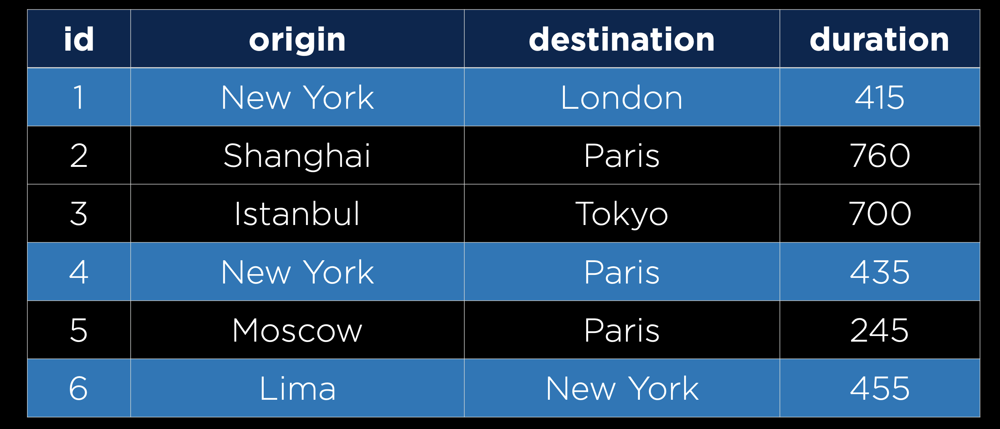

We can even use regular expressions to search words more broadly using the [LIKE](https://www.w3schools.com/sql/sql_like.asp) keyword. The below query finds all results with an `a` in the origin, by using `%` as a wildcard character.

<pre class="highlight"><code>SELECT * FROM flights WHERE origin LIKE "%a%";
</code></pre>

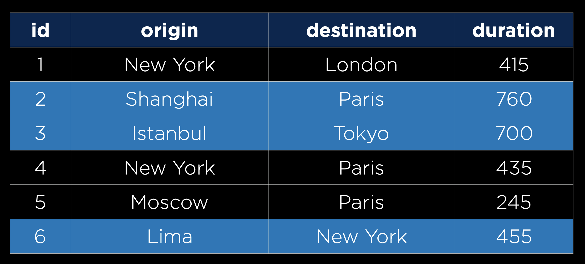

### Functions

There are also a number of SQL functions we can apply to the results of a query. These can be useful if we don’t need all of the data returned by a query, but just some summary statistics of the data.

  - [AVERAGE](https://www.w3schools.com/sql/sql_count_avg_sum.asp)
  - [COUNT](https://www.w3schools.com/sql/sql_count_avg_sum.asp)
  - [MAX](https://www.w3schools.com/sql/sql_min_max.asp)
  - [MIN](https://www.w3schools.com/sql/sql_min_max.asp)
  - [SUM](https://www.w3schools.com/sql/sql_count_avg_sum.asp)
  - …

### UPDATE

We’ve now seen how to add to and search tables, but we may also want to be able update rows of a table that already exist. We do this using the [UPDATE](https://www.w3schools.com/sql/sql_update.asp) command as shown below. As you may have guessed by reading this out loud, the command finds any flights that go from New York to London, and then sets their durations to 430.

<pre class="highlight"><code>UPDATE flights
    SET duration = 430
    WHERE origin = "New York"
    AND destination = "London";
</code></pre>

### DELETE

We also might want the ability to delete rows from our database, and we can do this using the [DELETE](https://www.w3schools.com/sql/sql_delete.asp) command. The following code will remove all flights that land in Tokyo:

<pre class="highlight"><code>DELETE FROM flights WHERE destination = "Tokyo";
</code></pre>

### Other Clauses

There are a number of additional clauses we can use to control queries coming back to us

  - [LIMIT](https://www.w3schools.com/sql/sql_top.asp): Limits the number of results returned by a query
  - [ORDER BY](https://www.w3schools.com/sql/sql_orderby.asp): Orders the results based on a specified column
  - [GROUP BY](https://www.w3schools.com/sql/sql_groupby.asp): Groups results by a specified column
  - [HAVING](https://www.w3schools.com/sql/sql_having.asp): Allows for additional constraints based on the number of results

## Joining Tables

So far, we’ve only been working with one table at a time, but many databases in practice are populated by a number of tables that all relate to each other in some way. In our flights example, let’s imagine we also want to add an airport code to go with the city. The way our table is currently set up, we would have to add two more columns to go with each row. We would also be repeating information, as we would have to write in multiple places that city X is associated with code Y.

One way we can solve this problem is by deciding to have one table that keeps track of flights, and then another table keeping track of airports. The second table might look something like this

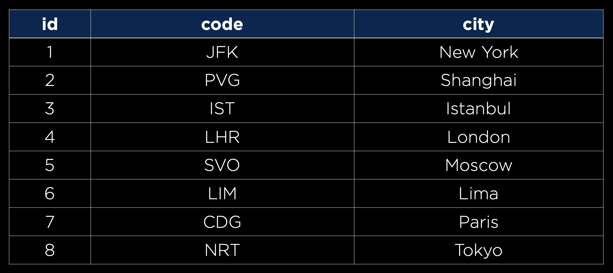

Now we have a table relating codes and cities, rather than storing an entire city name in our flights table, it will save storage space if we’re able to just save the `id` of that airport. Therefore, we should rewrite the flights table accordingly. Since we’re using the `id` column of the airports table to populate `origin_id` and `destination_id`, we call those values [Foreign Keys](https://www.w3schools.com/sql/sql_foreignkey.asp)

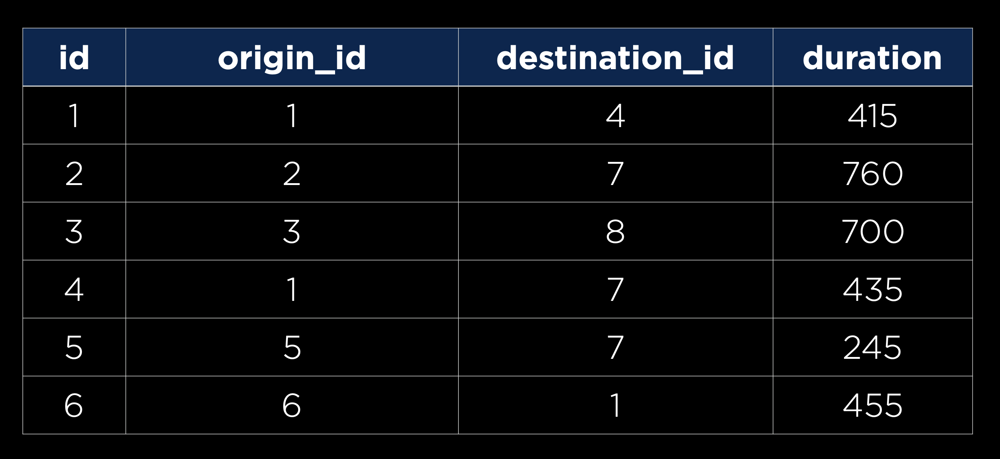

In addition to flights and airports, an airline might also want to store data about its passengers, like which flight each passenger will be on. Using the power of relational databases, we can add another table that stores first and last names, and a foreign key representing the flight they are on

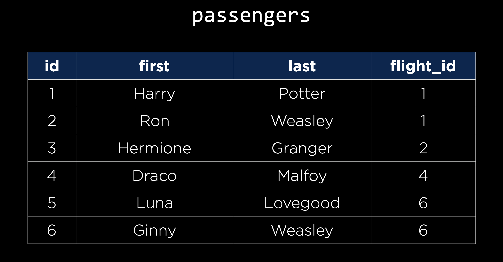

We can do even better than this though, as the same person may be on more than one flight. To account for this, we can create a `people` table that stores first and last names, and a `passengers` table that pairs people with flights

 query where we can combine two tables for the purposes of another query.

For example, let’s say we want to find the origin, destination, and first name of every trip a passenger is taking. Also for simplicity in this table, we’re going to be using the unoptimized `passengers` table that includes the flight id, first name, and last name. The first part of this query looks fairly familiar:

<pre class="highlight"><code>SELECT first, origin, destination
FROM ...
</code></pre>

But we run into a problem here because `first` is stored in the `passengers` table, while `origin` and `destination` are stored in the `flights` table. We solve this by joining the two tables using the fact that `flight_id` in the `passengers` table corresponds to `id` in the `flights` table:

<pre class="highlight"><code>SELECT first, origin, destination
FROM flights JOIN passengers
ON passengers.flight_id = flights.id;
</code></pre>

We’ve just used something called an [INNER JOIN](https://www.w3schools.com/sql/sql_join_inner.asp), which means we are ignoring rows that have no matches between the tables, but there are other types of joins, including [**LEFT JOIN**s](https://www.w3schools.com/sql/sql_join_left.asp), [**RIGHT JOIN**s](https://www.w3schools.com/sql/sql_join_right.asp), and [**FULL OUTER JOIN**s](https://www.w3schools.com/sql/sql_join_full.asp), which we won’t discuss here in detail.

### Indexing:

One way we can make our queries more efficient when dealing with large tables is to create an index similar to the index you might see in the back of a textbook. For example, if we know that we’ll often look up passengers by their last name, we could create an index from last name to id using the command:

<pre class="highlight"><code>CREATE INDEX name_index ON passengers (last);
</code></pre>

### SQL Vulnerabilities

<dl>
  <dt>Now that we know the basics of using SQL to work with data, it’s important to point out the main vulnerabilities associated with using SQL. We’ll start with <a href="https://www.w3schools.com/sql/sql_injection.asp">SQL Injection</a>.</dt>
  <dd>
    
A SQL injection attack is when a malicious user enters SQL code as input on a site in order to bypass the sites security measures. For example, let’s say we have a table storing usernames and passwords, and then a login form on the home site of a page. We may search for the user using a query such as:

  </dd>
</dl>

<pre class="highlight"><code>SELECT * FROM users
WHERE username = username AND password = password;
</code></pre>

A user named Harry might go to this site and type `harry` as a username and `12345` as a password, in which case the query would look like this:

<pre class="highlight"><code>SELECT * FROM users
WHERE username = "harry" AND password = "12345";
</code></pre>

A hacker, on the other hand, might type `harry" --` as a username and nothing as a password. It turns out that `--` stands for a comment in SQL, meaning the query would look like:

<pre class="highlight"><code>SELECT * FROM users
WHERE username = "harry"--" AND password = "12345";
</code></pre>

Because in this query the password checking has been commented out, the hacker can log into Harry’s account without knowing their password. To solve this problem, we can use:

  - Escape characters to make sure SQL treats the input as plain text and not as SQL code.
  - An abstraction layer on top of SQL which includes its own escape sequence, so we don’t have to write SQL queries ourselves.

<dl>
  <dt>The other main vulnerability when it comes to SQL is known as a <a href="https://searchstorage.techtarget.com/definition/race-condition#:~:text=A%20race%20condition%20is%20an,sequence%20to%20be%20done%20correctly.">Race Condition</a>.</dt>
  <dd>
    
A race condition is a situation that occurs when multiple queries to a database occur simultaneously. When these are not adequately handled, problems can arise in the precise times that databases are updated. For example, let’s say I have $150 in my bank account. A race condition could occur if I log into my bank account on both my phone and my laptop, and attempt to withdraw $100 on each device. If the bank’s software developers did not deal with race conditions correctly, then I may be able to withdraw $200 from an account with only $150 in it. One potential solution for this problem would be locking the database. We could not allow any other interaction with the database until one transaction has been completed. In the bank example, after clicking navigating to the “Make a Withdrawl” page on my computer, the bank might not allow me to navigate to that page on my phone.

  </dd>
</dl>

## Django Models

: [Django Models](https://docs.djangoproject.com/en/3.0/topics/db/models/) are a level of [abstraction](https://techterms.com/definition/abstraction) on top of SQL that allow us to work with databases using Python classes and objects rather than direct SQL queries.

Let’s get started on using models by creating a django project for our airline, and creating an app within that project.

<pre class="highlight"><code>django-admin startproject airline
cd airline
python manage.py startapp flights
</code></pre>

Now we’ll have to go through the process of adding an app as usual:

  1. Add `flights` to the `INSTALLED_APPS` list in `settings.py`
  1. Add a route for `flights` in `urls.py`:

<pre class="highlight"><code>path("flights/", include("flights.urls")),
</code></pre>

  1. Create a `urls.py` file within the `flights` application. And fill it with standard `urls.py` imports and lists.

Now, rather than creating actual paths and getting started on `views.py`, we’ll create some models in the `models.py` file. In this file, we’ll outline what data we want to store in our application. Then, Django will determine the SQL syntax necessary to store information on each of our models. Let’s take a look at what a model for a single flight might look like:

<pre class="highlight"><code>class Flight(models.Model):
    origin = models.CharField(max_length=64)
    destination = models.CharField(max_length=64)
    duration = models.IntegerField()
</code></pre>

Let’s take a look at what’s going on in this model definition:

  - In the first line, we create a new model that **extends** Django’s model class.
  - Below, we add fields for origin, destination, and duration. The first two are [Char Fields](https://docs.djangoproject.com/en/3.0/ref/forms/fields/#charfield), meaning they store strings, and the third is an [Integer Field](https://docs.djangoproject.com/en/3.0/ref/forms/fields/#integerfield). These are just two of many [built-in Django Field classes](https://docs.djangoproject.com/en/3.0/ref/forms/fields/#built-in-field-classes)
  - We specify maximum lengths of 64 for the two Character Fields. you can check the specifications available for a given field by checking the [documentation](https://docs.djangoproject.com/en/3.0/ref/forms/fields/#built-in-field-classes).

## Migrations

Now, even though we’ve created a model, we do not yet have a database to store this information. to create a database from our models, we navigate to the main directory of our project and run the command.

<pre class="highlight"><code>python manage.py makemigrations
</code></pre>

This command creates some Python files that will create or edit our database to be able to store what we have in our models. You should get an output that looks something like the one below, and if you navigate to your `migrations` directory, you’ll notice a new file was created for us

ext, to apply these migrations to our database, we run the command

<pre class="highlight"><code>python manage.py migrate
</code></pre>

Now, you’ll see some default migrations have been applied along with our own, and you’ll also notice that we now have a file called `db.sqlite3` in our project’s directory

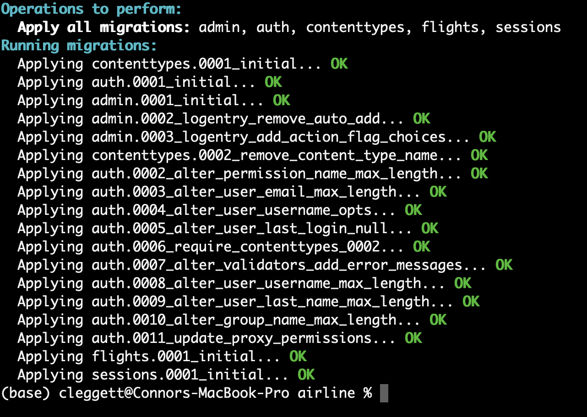

## Shell

Now, to begin working adding information to and manipulating this database, we can enter Django’s shell where we can run Python commands within our project.

<pre class="highlight"><code>python manage.py shell
Python 3.7.2 (default, Dec 29 2018, 00:00:04)
Type 'copyright', 'credits' or 'license' for more information
IPython 6.5.0 -- An enhanced Interactive Python. Type '?' for help.
</code></pre>

<pre class="highlight"><code># Import our flight model
In [1]: from flights.models import Flight

# Create a new flight
In [2]: f = Flight(origin="New York", destination="London", duration=415)

# Instert that flight into our database
In [3]: f.save()

# Query for all flights stored in the database
In [4]: Flight.objects.all()
Out[4]: &lt;QuerySet [&lt;Flight: Flight object (1)&gt;]&gt;
</code></pre>

When we query our database, we see that we get just one flight called `Flight object (1)`. This isn’t a very informative name, but we can fix that. Inside `models.py`, we’ll define a `__str__` function that provides instructions for how to turn a Flight object into a string:

<pre class="highlight"><code>class Flight(models.Model):
    origin = models.CharField(max_length=64)
    destination = models.CharField(max_length=64)
    duration = models.IntegerField()

    def __str__(self):
        return f"{self.id}: {self.origin} to {self.destination}"
</code></pre>

Now, when we go back to the shell, our output is a bit more readable:

<pre class="highlight"><code># Create a variable called flights to store the results of a query
In [7]: flights = Flight.objects.all()

# Displaying all flights
In [8]: flights
Out[8]: &lt;QuerySet [&lt;Flight: 1: New York to London&gt;]&gt;

# Isolating just the first flight
In [9]: flight = flights.first()

# Printing flight information
In [10]: flight
Out[10]: &lt;Flight: 1: New York to London&gt;

# Display flight id
In [11]: flight.id
Out[11]: 1

# Display flight origin
In [12]: flight.origin
Out[12]: 'New York'

# Display flight distination
In [13]: flight.destination
Out[13]: 'London'

# Display flight duration
In [14]: flight.duration
Out[14]: 415
</code></pre>

This is a good start, but thinking back to earlier, we don’t want to have to store the city name as an origin and destination for every flight, so we probably want another model for an airport that is somehow related to the flight model:

<pre class="highlight"><code>class Airport(models.Model):
    code = models.CharField(max_length=3)
    city = models.CharField(max_length=64)

    def __str__(self):
        return f"{self.city} ({self.code})"

class Flight(models.Model):
    origin = models.ForeignKey(Airport, on_delete=models.CASCADE, related_name="departures")
    destination = models.ForeignKey(Airport, on_delete=models.CASCADE, related_name="arrivals")
    duration = models.IntegerField()

    def __str__(self):
        return f"{self.id}: {self.origin} to {self.destination}"
</code></pre>

We’ve seen everything in our new `Airport` class before, but the changes to the `origin` and `destination` fields within the `Flight` class are new to us:

  - We specify that the `origin` and `destination` fields are each [Foreign Keys](https://docs.djangoproject.com/en/3.0/topics/db/examples/many_to_one/), which means they refer to another object.
  - By entering `Airport` as our first argument, we are specifying the type of object this field refers to.
  - The next argument, `on_delete=models.CASCADE` gives instructions for what should happen if an airport is deleted. In this case, we specify that when an airport is deleted, all flights associated with it should also be deleted. There are [several other options](https://docs.djangoproject.com/en/3.0/ref/models/fields/#django.db.models.ForeignKey.on_delete) in addition to `CASCADE`.
  - We provide a [related name](https://docs.djangoproject.com/en/3.0/ref/models/fields/#django.db.models.ForeignKey.related_name), which gives us a way to search for all flights with a given airport as their origin or destination.

Every time we make changes in `models.py`, we have to make migrations and then migrate. Note that you may have to delete your existing flight from New York to London, as it doesn’t fit in with the new database structure.

<pre class="highlight"><code># Create New Migrations
python manage.py makemigration

# Migrate
python manage.py migrate
</code></pre>

Now, let’s try these new models out in the Django shell:

<pre class="highlight"><code># Import all models
In [1]: from flights.models import *

# Create some new airports
In [2]: jfk = Airport(code="JFK", city="New York")
In [4]: lhr = Airport(code="LHR", city="London")
In [6]: cdg = Airport(code="CDG", city="Paris")
In [9]: nrt = Airport(code="NRT", city="Tokyo")

# Save the airports to the database
In [3]: jfk.save()
In [5]: lhr.save()
In [8]: cdg.save()
In [10]: nrt.save()

# Add a flight and save it to the database
f = Flight(origin=jfk, destination=lhr, duration=414)
f.save()

# Display some info about the flight
In [14]: f
Out[14]: &lt;Flight: 1: New York (JFK) to London (LHR)&gt;
In [15]: f.origin
Out[15]: &lt;Airport: New York (JFK)&gt;

# Using the related name to query by airport of arrival:
In [17]: lhr.arrivals.all()
Out[17]: &lt;QuerySet [&lt;Flight: 1: New York (JFK) to London (LHR)&gt;]&gt;
</code></pre>

### Starting our application

We can now begin to build an application around this process of using models to interact with a database. Let’s begin by creating an index route for our airline. Inside `urls.py`:

<pre class="highlight"><code>urlpatterns = [
    path('', views.index, name="index"),
]
</code></pre>

Inside `views.py`:

<pre class="highlight"><code>from django.shortcuts import render
from .models import Flight, Airport

# Create your views here.

def index(request):
    return render(request, "flights/index.html", {
        "flights": Flight.objects.all()
    })
</code></pre>

Inside our new `layout.html` file:

<pre class="highlight"><code>
&lt;!DOCTYPE html&gt;
&lt;html lang="en"&gt;
    &lt;head&gt;
        &lt;title&gt;Flights&lt;/title&gt;
    &lt;/head&gt;
    &lt;body&gt;
        
        
    &lt;/body&gt;
&lt;/html&gt;

</code></pre>

Inside a new `index.html` file:

<pre class="highlight"><code>



    &lt;h1&gt;Flights:&lt;/h1&gt;
    &lt;ul&gt;
        
            &lt;li&gt;Flight {{ flight.id }}: {{ flight.origin }} to {{ flight.destination }}&lt;/li&gt;
        
    &lt;/ul&gt;


</code></pre>

What we’ve done here is created a default page where we have a list of all flights we’ve created so far. When we open up the page now, it looks like this

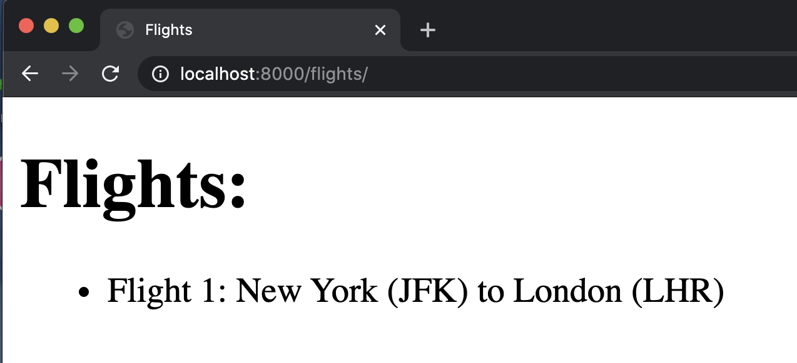

Now, let’s add some more flights to our application by returning to the Django shell:

<pre class="highlight"><code># Using the filter command to find all airports based in New York
In [3]: Airport.objects.filter(city="New York")
Out[3]: &lt;QuerySet [&lt;Airport: New York (JFK)&gt;]&gt;

# Using the get command to get only one airport in New York
In [5]: Airport.objects.get(city="New York")
Out[5]: &lt;Airport: New York (JFK)&gt;

# Assigning some airports to variable names:
In [6]: jfk = Airport.objects.get(city="New York")
In [7]: cdg = Airport.objects.get(city="Paris")

# Creating and saving a new flight:
In [8]: f = Flight(origin=jfk, destination=cdg, duration=435)
In [9]: f.save()
</code></pre>

Now, when we visit our site again

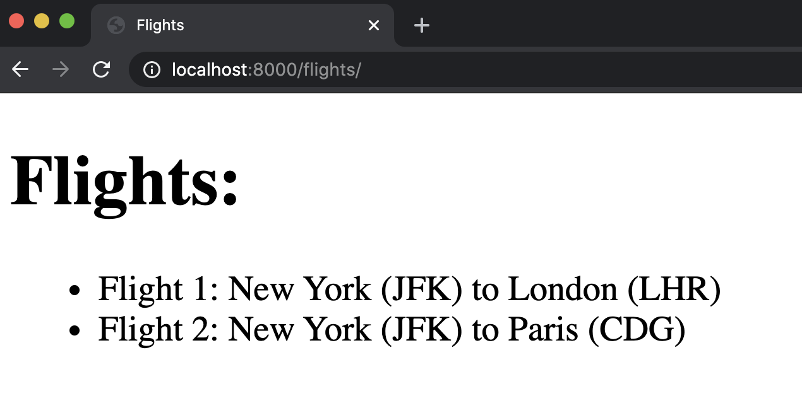

## Django Admin

Since it is so common for developers to have to create new objects like we’ve been doing in the shell, Django comes with a [default admin interface](https://docs.djangoproject.com/en/3.0/ref/contrib/admin/) that allows us to do this more easily. To begin using this tool, we must first create an administrative user:

<pre class="highlight"><code>(base) cleggett@Connors-MacBook-Pro airline % python manage.py createsuperuser
Username: user_a
Email address: a@a.com
Password:
Password (again):
Superuser created successfully.
</code></pre>

Now, we must add our models to the admin application by entering the `admin.py` file within our app, and importing and registering our models. This tells Django which models we would like to have access to in the admin app.

<pre class="highlight"><code>from django.contrib import admin
from .models import Flight, Airport

# Register your models here.
admin.site.register(Flight)
admin.site.register(Airport)
</code></pre>

Now, when we visit our site and add `/admin` to the url, we can log into a page that looks like this

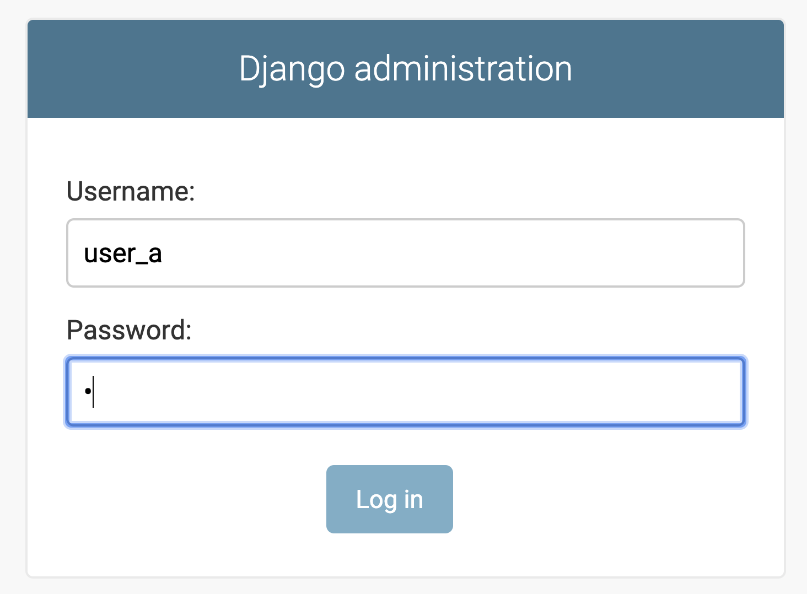

After loggin in, you’ll be brought to a page like the one below where you can create, edit, and delete objects stored in the database

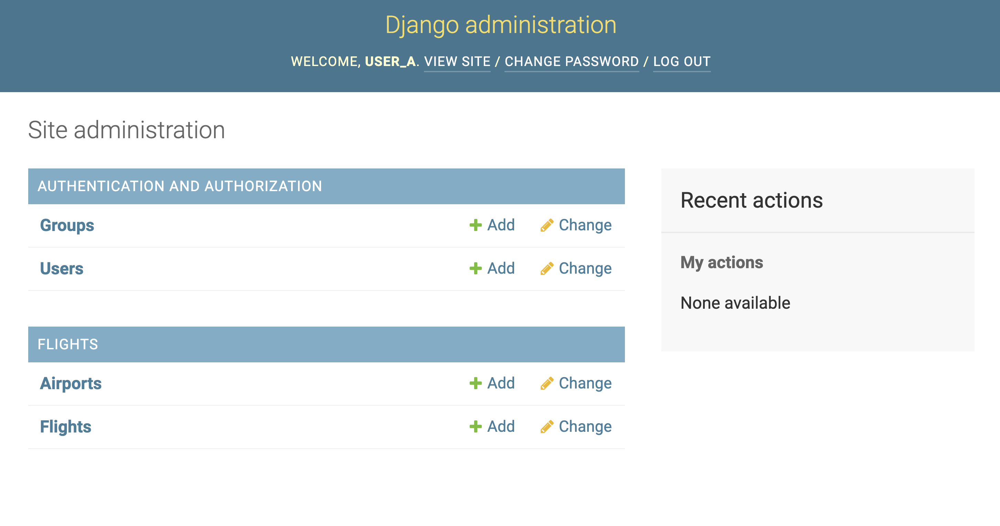

Now, let’s add a few more pages to our site. We’ll begin by adding the ability to click on a flight to get more information about it. To do this, let’s create a URL path that includes the `id` of a flight:

<pre class="highlight"><code>path("&lt;int:flight_id&gt;", views.flight, name="flight")
</code></pre>

Then, in `views.py` we will create a `flight` function that takes in a flight id and renders a new html page:

<pre class="highlight"><code>def flight(request, flight_id):
    flight = Flight.objects.get(id=flight_id)
    return render(request, "flights/flight.html", {
        "flight": flight
    })
</code></pre>

Now we’ll create a template to display this flight information with a link back to the home page

<pre class="highlight"><code>



    &lt;h1&gt;Flight {{ flight.id }}&lt;/h1&gt;
    &lt;ul&gt;
        &lt;li&gt;Origin: {{ flight.origin }}&lt;/li&gt;
        &lt;li&gt;Destination: {{ flight.destination }}&lt;/li&gt;
        &lt;li&gt;Duration: {{ flight.duration }} minutes&lt;/li&gt;
    &lt;/ul&gt;
    &lt;a href=""&gt;All Flights&lt;/a&gt;


</code></pre>

Finally, we need to add the ability to link from one page to another, so we’ll modify our index page to include links:

<pre class="highlight"><code>



    &lt;h1&gt;Flights:&lt;/h1&gt;
    &lt;ul&gt;
        
            &lt;li&gt;&lt;a href=""&gt;Flight {{ flight.id }}&lt;/a&gt;: {{ flight.origin }} to {{ flight.destination }}&lt;/li&gt;
        
    &lt;/ul&gt;


</code></pre>

Now our homepage looks like this

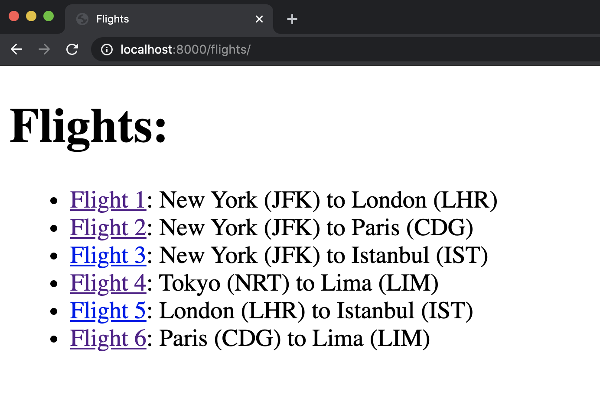

And when we click on flight 5, for example, we’re brought to this page

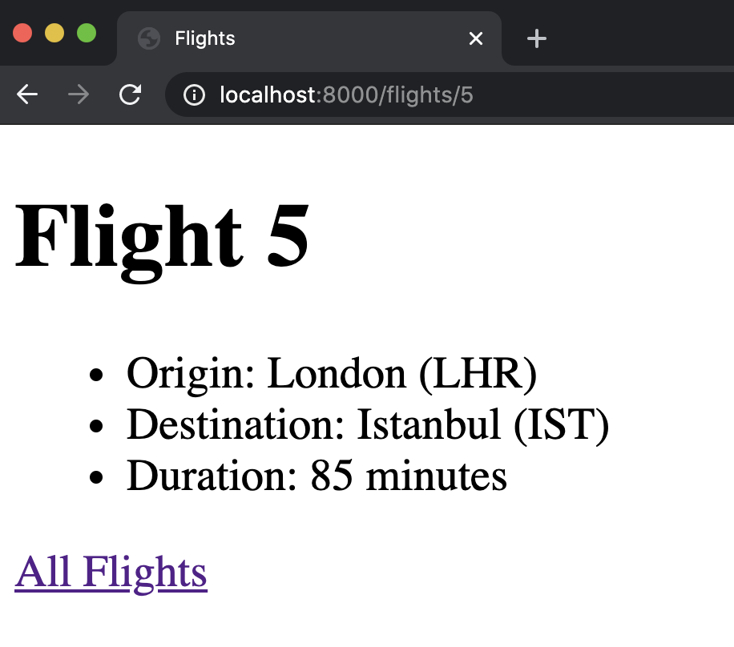

## Many-to-Many Relationships

Now, let’s work on integrating passengers into our models. We’ll create a passenger model to start:

<pre class="highlight"><code>class Passenger(models.Model):
    first = models.CharField(max_length=64)
    last = models.CharField(max_length=64)
    flights = models.ManyToManyField(Flight, blank=True, related_name="passengers")

    def __str__(self):
        return f"{self.first} {self.last}"
</code></pre>

  - As we discussed, passengers have a **Many to Many** relationship with flights, which we describe in Django using the ManyToManyField.
  - The first argument in this field is the class of objects that this one is related to.
  - We have provided the argument `blank=True` which means a passenger can have no flights
  - We have added a `related_name` that serves the same purpose as it did earlier: it will allow us to find all passengers on a given flight.

To actually make these changes, we must make migrations and migrate. We can then register the Passenger model in `admin.py` and visit the admin page to create some passengers!

Now that we’ve added some passengers, let’s update our flight page so that it displays all passengers on a flight. We’ll first visit `views.py` and update our flight view to provide a list of passengers as context. We access the list using the related name we defined earlier.

<pre class="highlight"><code>def flight(request, flight_id):
    flight = Flight.objects.get(id=flight_id)
    passengers = flight.passengers.all()
    return render(request, "flights/flight.html", {
        "flight": flight,
        "passengers": passengers
    })
</code></pre>

Now, add a list of passengers to `flight.html`:

<pre class="highlight"><code>
&lt;h2&gt;Passengers:&lt;/h2&gt;
&lt;ul&gt;
    
        &lt;li&gt;{{ passenger }}&lt;/li&gt;
    
        &lt;li&gt;No Passengers.&lt;/li&gt;
    
&lt;/ul&gt;

</code></pre>

At this point, when we click on flight 5, we see

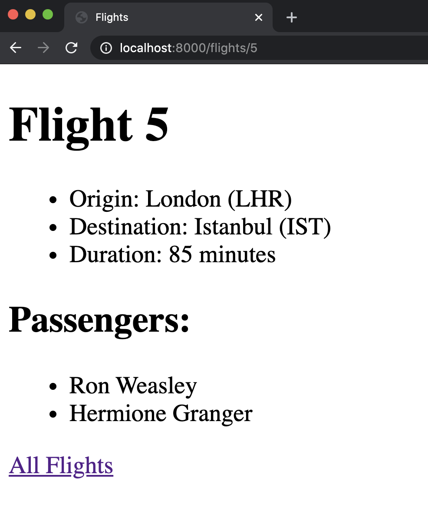

Now, let’s work on giving visitors to our site the ability to book a flight. We’ll do this by adding a booking route in `urls.py`:

<pre class="highlight"><code>path("&lt;int:flight_id&gt;/book", views.book, name="book")
</code></pre>

Now, we’ll add a book function to `views.py` that adds a passenger to a flight:

<pre class="highlight"><code>def book(request, flight_id):

    # For a post request, add a new flight
    if request.method == "POST":

        # Accessing the flight
        flight = Flight.objects.get(pk=flight_id)

        # Finding the passenger id from the submitted form data
        passenger_id = int(request.POST["passenger"])

        # Finding the passenger based on the id
        passenger = Passenger.objects.get(pk=passenger_id)

        # Add passenger to the flight
        passenger.flights.add(flight)

        # Redirect user to flight page
        return HttpResponseRedirect(reverse("flight", args=(flight.id,)))
</code></pre>

Next, we’ll add some context to our flight template so that the page has access to everyone who is not currently a passenger on the flight using Django’s ability to [exclude](https://docs.djangoproject.com/en/3.0/topics/db/queries/#retrieving-specific-objects-with-filters) certain objects from a query:

<pre class="highlight"><code>def flight(request, flight_id):
    flight = Flight.objects.get(id=flight_id)
    passengers = flight.passengers.all()
    non_passengers = Passenger.objects.exclude(flights=flight).all()
    return render(request, "flights/flight.html", {
        "flight": flight,
        "passengers": passengers,
        "non_passengers": non_passengers
    })
</code></pre>

Now, we’ll add a form to our flight page’s HTML using a select input field:

<pre class="highlight"><code>
&lt;form action="" method="post"&gt;
    
    &lt;select name="passenger" id=""&gt;
        
            &lt;option value="{{ passenger.id }}"&gt;{{ passenger }}&lt;/option&gt;
        
    &lt;/select&gt;
    &lt;input type="submit"&gt;
&lt;/form&gt;

</code></pre>

Now, let’s see what the site looks like when I go to a flight page and then add a passenger

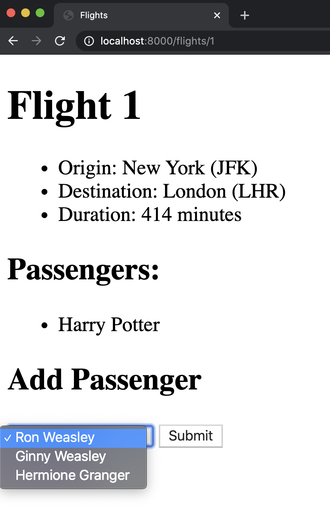

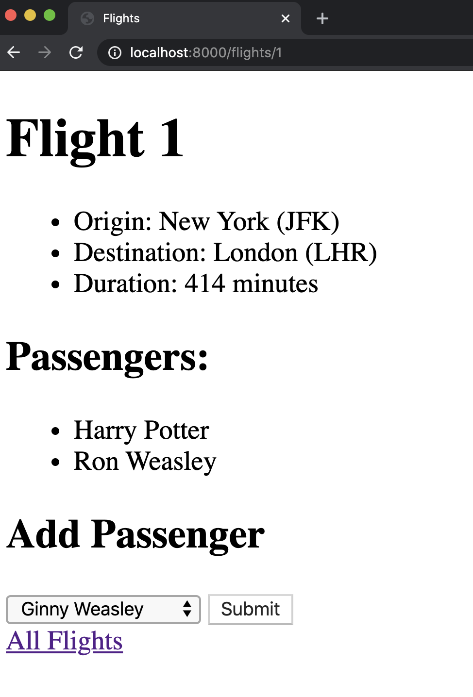

Another advantage of using the Django admin app is that it is customizable. For example, if we wish to see all aspects of a flight in the admin interface, we can create a new class within `admin.py` and add it as an argument when registering the `Flight` model:

<pre class="highlight"><code>class FlightAdmin(admin.ModelAdmin):
    list_display = ("id", "origin", "destination", "duration")

# Register your models here.
admin.site.register(Flight, FlightAdmin)
</code></pre>

Now, when we visit the admin page for flights, we can see the `id` as well

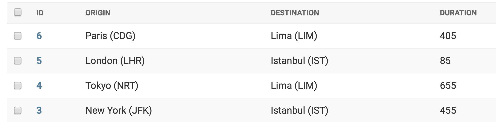

heck out [Django’s admin documentation](https://docs.djangoproject.com/en/3.0/ref/contrib/admin/) to find more ways to customize the admin app.

## Users

The last thing we’ll discuss in lecture today is the idea of authentication, or allowing users to log in and out of a website. Fortunately, Django makes this very easy for us, so let’s go through an example of how we would do this. We’ll start by creating a new app called `users`. Here we’ll go through all the normal steps of creating a new app, but in our new `urls.py` file, we’ll add a few more routes:

<pre class="highlight"><code>urlpatterns = [
    path('', views.index, name="index"),
    path("login", views.login_view, name="login"),
    path("logout", views.logout_view, name="logout")
]
</code></pre>

Let’s begin by creating a form where a user can log in. We’ll create a `layout.html` file as always, and then create a `login.html` file which contains a form, and that displays a message if one exists.

<pre class="highlight"><code>



    
        &lt;div&gt;{{ message }}&lt;/div&gt;
    

    &lt;form action="" method="post"&gt;
        
        &lt;input type="text", name="username", placeholder="Username"&gt;
        &lt;input type="password", name="password", placeholder="Password"&gt;
        &lt;input type="submit", value="Login"&gt;
    &lt;/form&gt;


</code></pre>

Now, in `views.py`, we’ll add three functions:

<pre class="highlight"><code>def index(request):
    # If no user is signed in, return to login page:
    if not request.user.is_authenticated:
        return HttpResponseRedirect(reverse("login"))
    return render(request, "users/user.html")

def login_view(request):
    return render(request, "users/login.html")

def logout_view(request):
    # Pass is a simple way to tell python to do nothing.
    pass
</code></pre>

Next, we can head to the admin site and add some users. After doing that, we’ll go back to `views.py` and update our `login_view` function to handle a `POST` request with a username and password:

<pre class="highlight"><code># Additional imports we'll need:
from django.contrib.auth import authenticate, login, logout

def login_view(request):
    if request.method == "POST":
        # Accessing username and password from form data
        username = request.POST["username"]
        password = request.POST["password"]

        # Check if username and password are correct, returning User object if so
        user = authenticate(request, username=username, password=password)

        # If user object is returned, log in and route to index page:
        if user:
            login(request, user)
            return HttpResponseRedirect(reverse("index"))
        # Otherwise, return login page again with new context
        else:
            return render(request, "users/login.html", {
                "message": "Invalid Credentials"
            })
    return render(request, "users/login.html")
</code></pre>

Now, we’ll create the `user.html` file that the `index` function renders when a user is authenticated:

<pre class="highlight"><code>



    &lt;h1&gt;Welcome, {{ request.user.first_name }}&lt;/h1&gt;
    &lt;ul&gt;
        &lt;li&gt;Username: {{ request.user.username }}&lt;/li&gt;
        &lt;li&gt;Email: {{ request.user.email }}&lt;/li&gt;
    &lt;/ul&gt;

    &lt;a href=""&gt;Log Out&lt;/a&gt;


</code></pre>

Finally, to allow the user to log out, we’ll update the `logout_view` function so that it uses Django’s built-in `logout` function:

<pre class="highlight"><code>def logout_view(request):
    logout(request)
    return render(request, "users/login.html", {
                "message": "Logged Out"
            })
</code></pre>

Now that we’re finished, here’s a demonstration of the site

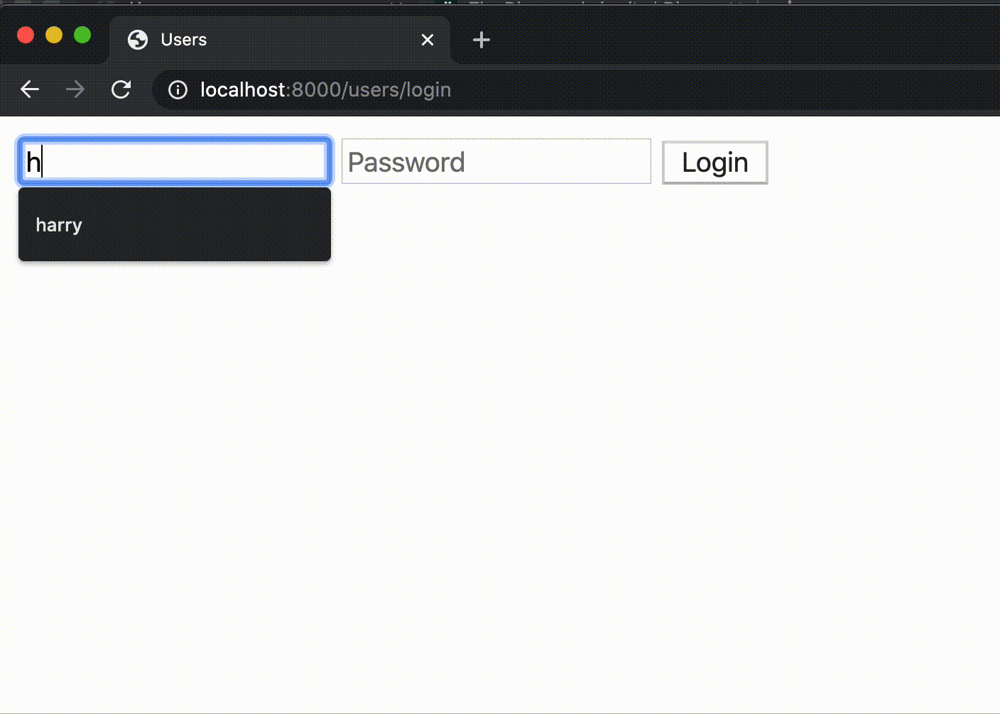

That’s all for this lecture! Next time, we’ll learn our second programming language of the course: JavaScript.

                </main>

            

        

