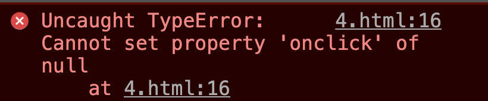
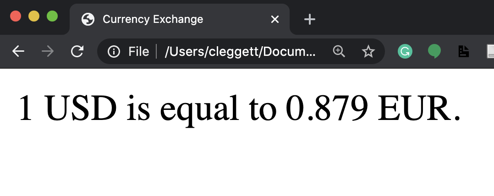

        

            

                <aside class="col-md">

                    <header>
# [CS50’s Web Programming with Python and JavaScript](../..)

OpenCourseWare

[Brian Yu](https://brianyu.me)  
&#10;[brian@cs.harvard.edu](mailto:brian@cs.harvard.edu)

[David J. Malan](https://cs.harvard.edu/malan/)  
&#10;[malan@harvard.edu](mailto:malan@harvard.edu)  
&#10;[<i class="fab fa-facebook-f"></i>](https://www.facebook.com/dmalan)[<i class="fab fa-github"></i>](https://github.com/dmalan)[<i class="fab fa-instagram"></i>](https://www.instagram.com/davidjmalan/)[<i class="fab fa-linkedin"></i>](https://www.linkedin.com/in/malan/)[<i class="fab fa-quora"></i>](https://www.quora.com/profile/David-J-Malan)[<i class="fab fa-reddit-alien"></i>](https://www.reddit.com/user/davidjmalan)[<i class="fab fa-twitter"></i>](https://twitter.com/davidjmalan)

</header>

                    <button aria-controls="nav" aria-expanded="false" class="btn btn-sm collapsed d-md-none" data-target="aside > nav" data-toggle="collapse">
                        Menu
                    </button>

                    <nav class="collapse d-md-block" id="nav">
- - -

1. [HTML, CSS](../../weeks/0/)

1. [Git](../../weeks/1/)

1. [Python](../../weeks/2/)

1. [Django](../../weeks/3/)

1. [SQL, Models, and Migrations](../../weeks/4/)

1. [JavaScript](../../weeks/5/)

1. [User Interfaces](../../weeks/6/)

1. [Testing, CI/CD](../../weeks/7/)

1. [Scalability and Security](../../weeks/8/)

- - -

- [CS50 Certificate](../../certificate/)

- [FAQs](../../faqs/)

- - -

- [Ed Discussion](https://cs50.harvard.edu/web/ed) for Q&amp;A

- [Quick Start Guide](https://us.edstem.org/quickstart/ed-discussion.pdf)

- - -

- [edX](https://cs50.edx.org/web)

- [iTunes U](https://itunes.apple.com/us/course/id1505432709)

- [YouTube](https://www.youtube.com/playlist?list=PLhQjrBD2T380xvFSUmToMMzERZ3qB5Ueu)

- - -

- [Changelog](https://cs50.noticeable.io/)

- [Status Page](https://cs50.statuspage.io/)

- - -

-

    [Communities](../../communities/)

- [Discord](https://discord.gg/cs50)

- [Facebook Group](https://www.facebook.com/groups/cs50/)

- [Facebook Page](https://www.facebook.com/cs50/)

- [GitHub](https://github.com/cs50)

- [Gitter](https://gitter.im/cs50/x)

- [Instagram](https://instagram.com/cs50)

- [LinkedIn Group](https://www.linkedin.com/groups/7437240/)

- [LinkedIn Page](https://www.linkedin.com/school/CS50/)

- [Quora](https://www.quora.com/topic/CS50)

- [Slack](https://cs50.edx.org/slack)

- [Snapchat](https://www.snapchat.com/add/cs50)

- [Twitter](https://twitter.com/cs50)

- [YouTube](http://www.youtube.com/subscription_center?add_user=cs50tv)

- - -

- - -

[<i class="fab fa-creative-commons mr-1"></i>License](../../license/)

</nav>

                    <footer></footer>

                </aside>

                <main class="col-md markdown-body">

                    # Lecture 5

  - [Introduction](#introduction)
  - [JavaScript](#javascript)
  - [Events](#events)
  - [Variables](#variables)
  - [`querySelector`](#queryselector)
  - [DOM Manipulation](#dom-manipulation)    
                  - [JavaScript Console](#javascript-console)
                  - [Arrow Functions](#arrow-functions)
                  - [TODO List](#todo-list)

  - [Intervals](#intervals)
  - [Local Storage](#local-storage)
  - [APIs](#apis)    
                  - [JavaScript Objects](#javascript-objects)
                  - [Currency Exchange](#currency-exchange)

## Introduction

  - So far, we’ve discussed how to build simple web pages using HTML and CSS, and how to use Git and GitHub in order to keep track of changes to our code and collaborate with others. We also familiarized ourselves with the Python programming language, started using Django to create web applications, and learned how to use Django models to store information in our sites.
  - Today, we’ll introduce a new programming language: JavaScript.

## JavaScript

Let’s begin by revisiting a diagram from a couple of lectures ago:

Recall that in most online interactions, we have a client/user that sends an HTTP Request to a server, which sends back an HTTP Response. All of the Python code we’ve written so far using Django has been running on a server. JavaScript will allow us to run code on the client side, meaning no interaction with the server is necessary while it’s running, allowing our websites to become much more interactive.

In order to add some JavaScript to our page, we can add a pair of `&lt;script&gt;` tags somewhere in our HTML page. We use `&lt;script&gt;` tags to signal to the browser that anything we write in between the two tags is JavaScript code we wish to execute when a user visits our site. Our first program might look something like this:

<pre class="highlight"><code>alert('Hello, world!');
</code></pre>

The `alert` function in JavaScript displays a message to the user which they can then dismiss. To show where this would fit into an actual HTML document, here’s an example of a simple page with some JavaScript:

<pre class="highlight"><code>&lt;!DOCTYPE html&gt;
&lt;html lang="en"&gt;
    &lt;head&gt;
        &lt;title&gt;Hello&lt;/title&gt;
        &lt;script&gt;
            alert('Hello, world!');
        &lt;/script&gt;
    &lt;/head&gt;
    &lt;body&gt;
        &lt;h1&gt;Hello!&lt;/h1&gt;
    &lt;/body&gt;
&lt;/html&gt;
</code></pre>

## Events

<dl>
  <dt>One feature of JavaScript that makes it helpful for web programming is that it supports <a href="https://medium.com/@vsvaibhav2016/introduction-to-event-driven-programming-28161b79c223">Event-Driven Programming</a>.</dt>
  <dd>Event-Driven Programming is a programming paradigm that centers around the detection of events, and actions that should be taken when an event is detected.</dd>
</dl>

An event can be almost anything including a button being clicked, the cursor being moved, a response being typed, or a page being loaded. Just about everything a user does to interact with a web page can be thought of as an event. In JavaScript, we use [Event Listeners](https://www.w3schools.com/js/js_htmldom_eventlistener.asp) that wait for certain events to occur, and then execute some code.

Let’s begin by turning our JavaScript from above into a [function](https://www.w3schools.com/js/js_functions.asp) called `hello`:

<pre class="highlight"><code>function hello() {
    alert('Hello, world!')
}
</code></pre>

Now, let’s work on running this function whenever a button is clicked. To do this, we’ll create an HTML button in our page with an `onclick` attribute, which gives the browser instructions for what should happen when the button is clicked:

<pre class="highlight"><code>&lt;button onclick="hello()"&gt;Click Here&lt;/button&gt;
</code></pre>

These changes to our code

## Variables

JavaScript is a programming language just like Python, C, or any other language you’ve worked with before, meaning it has many of the same features as other languages including variables. There are three keywords we can use to assign values in JavaScript:

  - `var`: used to define a variable globally

<pre class="highlight"><code>var age = 20;
</code></pre>

  - `let`: used to define a variable that is limited in scope to the current block such as a function or loop

<pre class="highlight"><code>let counter = 1;
</code></pre>

  - `const`: used to define a value that will not change

<pre class="highlight"><code>const PI = 3.14;
</code></pre>

For an example of how we can use a variable, let’s take a look at a page that keeps track of a counter:

<pre class="highlight"><code>&lt;!DOCTYPE html&gt;
&lt;html lang="en"&gt;
    &lt;head&gt;
        &lt;title&gt;Count&lt;/title&gt;
        &lt;script&gt;
            let counter = 0;
            function count() {
                counter++;
                alert(counter);
            }
        &lt;/script&gt;
    &lt;/head&gt;
    &lt;body&gt;
        &lt;h1&gt;Hello!&lt;/h1&gt;
        &lt;button onclick="count()"&gt;Count&lt;/button&gt;
    &lt;/body&gt;
&lt;/html&gt;
</code></pre>

## `querySelector`

In addition to allowing us to display messages through alerts, JavaScript also allows us to change elements on the page. In order to do this, we must first introduce a function called `document.querySelector`. This function searches for and returns elements of the DOM. For example, we would use:

<pre class="highlight"><code>let heading = document.querySelector('h1');
</code></pre>

to extract a heading. Then, to manipulate the element we’ve recently found, we can change its `innerHTML` property:

<pre class="highlight"><code>heading.innerHTML = `Goodbye!`;
</code></pre>

Just as in Python, we can also take advantage of [conditions](https://www.w3schools.com/js/js_if_else.asp) in JavaScript. For example, let’s say rather than always changing our header to `Goodbye!`, we wish to toggle back and forth between `Hello!` and `Goodbye!`. Our page might then look something like the one below. Notice that in JavaScript, we use `===` as a stronger comparison between two items which also checks that the objects are of the same type. We typically want to use `===` whenever possible.

<pre class="highlight"><code>&lt;!DOCTYPE html&gt;
&lt;html lang="en"&gt;
    &lt;head&gt;
        &lt;title&gt;Count&lt;/title&gt;
        &lt;script&gt;
            function hello() {
                const header = document.querySelector('h1');
                if (header.innerHTML === 'Hello!') {
                    header.innerHTML = 'Goodbye!';
                }
                else {
                    header.innerHTML = 'Hello!';
                }
            }
        &lt;/script&gt;
    &lt;/head&gt;
    &lt;body&gt;
        &lt;h1&gt;Hello!&lt;/h1&gt;
        &lt;button onclick="hello()"&gt;Click Here&lt;/button&gt;
    &lt;/body&gt;
&lt;/html&gt;
</code></pre>

## DOM Manipulation

Let’s use this idea of DOM manipulation to improve our counter page:

<pre class="highlight"><code>&lt;!DOCTYPE html&gt;
&lt;html lang="en"&gt;
    &lt;head&gt;
        &lt;title&gt;Count&lt;/title&gt;
        &lt;script&gt;
            let counter = 0;
            function count() {
                counter++;
                document.querySelector('h1').innerHTML = counter;
            }
        &lt;/script&gt;
    &lt;/head&gt;
    &lt;body&gt;
        &lt;h1&gt;0&lt;/h1&gt;
        &lt;button onclick="count()"&gt;Count&lt;/button&gt;
    &lt;/body&gt;
&lt;/html&gt;
</code></pre>

We can make this page even more interesting by displaying an alert every time the counter gets to a multiple of ten. In this alert, we’ll want to format a string to customize the message, which in JavaScript we can do using [template literals](https://developer.mozilla.org/en-US/docs/Web/JavaScript/Reference/Template_literals). Template literals requre that there are backticks (`` ` ``) around the entire expression and a $ and curly braces around any substitutions. For example, let’s change our count function

<pre class="highlight"><code>function count() {
    counter++;
    document.querySelector('h1').innerHTML = counter;

    if (counter % 10 === 0) {
        alert(`Count is now ${counter}`)
    }
}
</code></pre>

Now, let’s look at some ways in which we can improve the design of this page. First, just as we try to avoid in-line styling with CSS, we want to avoid in-line JavaScript as much as possible. We can do this in our counter example by adding a line of script that changes the `onclick` attribute of a button on the page, and removing the `onclick` attribute from within the `button` tag.

<pre class="highlight"><code>document.querySelector('button').onclick = count;
</code></pre>

One thing to notice about what we’ve just done is that we’re not calling the `count` function by adding parentheses afterward, but instead just naming the function. This specifies that we only wish to call this function when the button is clicked. This works because, like Python, JavaScript supports functional programming, so functions can be treated as values themselves.

The above change alone is not enough though, as we can see by inspecting the page and looking at our browser’s console:

This error came up because when JavaScript searched for an element using `document.querySelector('button')`, it didn’t find anything. This is because it takes a small bit of time for the page to load, and our JavaScript code ran before the button had been rendered. To account for this, we can specify that code will run only after the page has loaded using the [addEventListener](https://www.w3schools.com/jsref/met_document_addeventlistener.asp) function. This function takes in two arguments:

  1. An event to listen for (eg: `'click'`)
  1. A function to run when the event is detected (eg: `hello` from above)

We can use the function to only run the code once all content has loaded:

<pre class="highlight"><code>document.addEventListener('DOMContentLoaded', function() {
    // Some code here
});
</code></pre>

In the example above, we’ve used an [anonymous](https://www.w3schools.com/js/js_function_definition.asp) function, which is a function that is never given a name. Putting all of this together, our JavaScript now looks like this:

<pre class="highlight"><code>let counter = 0;

function count() {
    counter++;
    document.querySelector('h1').innerHTML = counter;

    if (counter % 10 === 0) {
        alert(`Count is now ${counter}`)
    }
}

document.addEventListener('DOMContentLoaded', function() {
    document.querySelector('button').onclick = count;
});
</code></pre>

Another way that we can improve our design is by moving our JavaScript into a separate file. The way we do this is very similar to how we put our CSS in a separate file for styling:

  1. Write all of your JavaScript code in a separate file ending in `.js`, maybe `index.js`.
  1. Add a `src` attribute to the `&lt;script&gt;` tag that points to this new file.

For our counter page, we could have a file called `counter.html` that looks like this:

<pre class="highlight"><code>&lt;!DOCTYPE html&gt;
&lt;html lang="en"&gt;
    &lt;head&gt;
        &lt;title&gt;Count&lt;/title&gt;
        &lt;script src="counter.js"&gt;&lt;/script&gt;
    &lt;/head&gt;
    &lt;body&gt;
        &lt;h1&gt;0&lt;/h1&gt;
        &lt;button&gt;Count&lt;/button&gt;
    &lt;/body&gt;
&lt;/html&gt;
</code></pre>

And a file called `counter.js` that looks like this:

<pre class="highlight"><code>let counter = 0;

function count() {
    counter++;
    document.querySelector('h1').innerHTML = counter;

    if (counter % 10 === 0) {
        alert(`Count is now ${counter}`)
    }
}

document.addEventListener('DOMContentLoaded', function() {
    document.querySelector('button').onclick = count;
});
</code></pre>

Having JavaScript in a separate file is useful for a number of reasons:

  - Visual appeal: Our individual HTML and JavaScript files become more readable.
  - Access among HTML files: Now we can have multiple HTML files that all share the same JavaScript.
  - Collaboration: We can now easily have one person work on the JavaScript while another works on HTML.
  - Importing: We are able to import JavaScript libraries that other people have already written. For example [Bootstrap](https://getbootstrap.com/docs/4.5/getting-started/introduction/#js) has their own JavaScript library you can include to make your site more interactive.

Let’s get started on another example of a page that can be a bit more interactive. Below, we’ll create a page where a user can type in their name to get a custom greeting.

<pre class="highlight"><code>&lt;!DOCTYPE html&gt;
&lt;html lang="en"&gt;
&lt;head&gt;
    &lt;title&gt;Hello&lt;/title&gt;
    &lt;script&gt;
        document.addEventListener('DOMContentLoaded', function() {
            document.querySelector('form').onsubmit = function() {
                const name = document.querySelector('#name').value;
                alert(`Hello, ${name}`);
            };
        });
    &lt;/script&gt;
&lt;/head&gt;
&lt;body&gt;
    &lt;form&gt;
        &lt;input autofocus id="name" placeholder="Name" type="text"&gt;
        &lt;input type="submit"&gt;
    &lt;/form&gt;
&lt;/body&gt;
&lt;/html&gt;
</code></pre>

Some notes about the page above:

  - We use the `autofocus` field in the `name` input to indicate that the cursor should be set inside that input as soon as the page is loaded.
  - We use `#name` inside of `document.querySelector` to find an element with an `id` of `name`. We can use all the same selectors in this function as we could in CSS.
  - We use the `value` attribute of an input field to find what is currently typed in.

We can do more than just add HTML to our page using JavaScript, we can also change the styling of a page! In the page below, we use buttons to change the color of our heading.

<pre class="highlight"><code>&lt;!DOCTYPE html&gt;
&lt;html lang="en"&gt;
&lt;head&gt;
     &lt;title&gt;Colors&lt;/title&gt;
     &lt;script&gt;
         document.addEventListener('DOMContentLoaded', function() {
            document.querySelectorAll('button').forEach(function(button) {
                button.onclick = function() {
                    document.querySelector("#hello").style.color = button.dataset.color;
                }
            });
         });
     &lt;/script&gt;
&lt;/head&gt;
&lt;body&gt;
    &lt;h1 id="hello"&gt;Hello&lt;/h1&gt;
    &lt;button data-color="red"&gt;Red&lt;/button&gt;
    &lt;button data-color="blue"&gt;Blue&lt;/button&gt;
    &lt;button data-color="green"&gt;Green&lt;/button&gt;
&lt;/body&gt;
&lt;/html&gt;
</code></pre>

Some notes on the page above:

  - We change the style of an element using the `style.SOMETHING` attribute.
  - We use the `data-SOMETHING` attribute to assign data to an HTML element. We can later access that data in JavaScript using the element’s `dataset` property.
  - We use the `querySelectorAll` function to get an [Node List](https://www.w3schools.com/js/js_htmldom_nodelist.asp) (similar to a Python list or a JavaScript [array](https://www.w3schools.com/js/js_arrays.asp)) with all elements that match the query.
  - The [forEach](https://www.w3schools.com/jsref/jsref_foreach.asp) function in JavaScript takes in another function, and applies that function to each element in a list or array.

### JavaScript Console

The console is a useful tool for testing out small bits of code and debugging. You can write and run JavaScript code in the console, which can be found by inspecting element in your web browser and then clicking `console`. (The exact process may change frome browser to browser.) One useful tool for debugging is printing to the console, which you can do using the `console.log` function. For example, in the `colors.html` page above, I can add the following line:

<pre class="highlight"><code>console.log(document.querySelectorAll('button'));
</code></pre>

Which gives us this in the console:

### Arrow Functions

In addition to the traditional function notation we’ve seen already, JavaScript now gives us the ability to use [Arrow Functions](https://www.w3schools.com/js/js_arrow_function.asp) where we have an input (or parentheses when there’s no input) followed by `=&gt;` followed by some code to be run. For example, we can alter our script above to use an anonymous arrow function:

<pre class="highlight"><code>document.addEventListener('DOMContentLoaded', () =&gt; {
    document.querySelectorAll('button').forEach(button =&gt; {
        button.onclick = () =&gt; {
            document.querySelector("#hello").style.color = button.dataset.color;
        }
    });
});
</code></pre>

We can also have named functions that use arrows, as in this rewriting of the count function:

<pre class="highlight"><code>count = () =&gt; {
    counter++;
    document.querySelector('h1').innerHTML = counter;

    if (counter % 10 === 0) {
        alert(`Count is now ${counter}`)
    }
}
</code></pre>

To get an idea about some other events we can use, let’s see how we can implement our color switcher using a dropdown menu instead of three separate buttons. We can detect changes in a `select` element using the `onchange` attribute. In JavaScript, [this](https://www.w3schools.com/js/js_this.asp) is a keyword that changes based on the context in which it’s used. In the case of an event handler, `this` refers to the object that triggered the event.

<pre class="highlight"><code>&lt;!DOCTYPE html&gt;
&lt;html lang="en"&gt;
    &lt;head&gt;
        &lt;title&gt;Colors&lt;/title&gt;
        &lt;script&gt;
            document.addEventListener('DOMContentLoaded', function() {
                document.querySelector('select').onchange = function() {
                    document.querySelector('#hello').style.color = this.value;
                }
            });
        &lt;/script&gt;
    &lt;/head&gt;
    &lt;body&gt;
        &lt;h1 id="hello"&gt;Hello&lt;/h1&gt;
        &lt;select&gt;
            &lt;option value="black"&gt;Black&lt;/option&gt;
            &lt;option value="red"&gt;Red&lt;/option&gt;
            &lt;option value="blue"&gt;Blue&lt;/option&gt;
            &lt;option value="green"&gt;Green&lt;/option&gt;
        &lt;/select&gt;

    &lt;/body&gt;
&lt;/html&gt;
</code></pre>

There are many other [events](https://www.w3schools.com/js/js_events.asp) we can detect in JavaScript including the common ones below:

  - `onclick`
  - `onmouseover`
  - `onkeydown`
  - `onkeyup`
  - `onload`
  - `onblur`
  - …

### TODO List

To put together a few of the things we’ve learned in this lecture, let’s work on making a TODO list entirely in JavaScript. We’ll start by writing the HTML layout of the page. Notice below how we leave space for an unorderd list, but we dont yet add anything to it. Also notice that we add a link to `tasks.js` where we’ll write our JavaScript.

<pre class="highlight"><code>&lt;!DOCTYPE html&gt;
&lt;html lang="en"&gt;
    &lt;head&gt;
        &lt;title&gt;Tasks&lt;/title&gt;
        &lt;script src="tasks.js"&gt;&lt;/script&gt;
    &lt;/head&gt;
    &lt;body&gt;
        &lt;h1&gt;Tasks&lt;/h1&gt;
        &lt;ul id="tasks"&gt;&lt;/ul&gt;
        &lt;form&gt;
            &lt;input id="task" placeholder = "New Task" type="text"&gt;
            &lt;input id="submit" type="submit"&gt;
        &lt;/form&gt;
    &lt;/body&gt;
&lt;/html&gt;
</code></pre>

Now, here’s our code which we can keep in `tasks.js`. A few notes on what you’ll see below:

  - This code is slightly different from the code in lecture. Here, we only query for our submit button and input task field once in the beginning and store those two values in the variables `submit` and `newTask`.
  - We can enable/disable a button by setting its `disabled` attribute to `false`/`true`.
  - In JavaScript, we use `.length` to find the length of objects such as strings and arrays.
  - At the end of the script, we add the line `return false`. This prevents the default submission of the form which involves either reloading the current page or redirecting to a new one.
  - In JavaScript, we can create HTML elements using the [createElement](https://www.w3schools.com/jsref/met_document_createelement.asp) function. We can then add those elements to the DOM using the `append` function.

<pre class="highlight"><code>// Wait for page to load
document.addEventListener('DOMContentLoaded', function() {

    // Select the submit button and input to be used later
    const submit = document.querySelector('#submit');
    const newTask = document.querySelector('#task');

    // Disable submit button by default:
    submit.disabled = true;

    // Listen for input to be typed into the input field
    newTask.onkeyup = () =&gt; {
        if (newTask.value.length &gt; 0) {
            submit.disabled = false;
        }
        else {
            submit.disabled = true;
        }
    }

    // Listen for submission of form
    document.querySelector('form').onsubmit = () =&gt; {

        // Find the task the user just submitted
        const task = newTask.value;

        // Create a list item for the new task and add the task to it
        const li = document.createElement('li');
        li.innerHTML = task;

        // Add new element to our unordered list:
        document.querySelector('#tasks').append(li);

        // Clear out input field:
        newTask.value = '';

        // Disable the submit button again:
        submit.disabled = true;

        // Stop form from submitting
        return false;
    }
});
</code></pre>

## Intervals

In addition to specifying that functions run when an event is triggered, we can also set functions to run after a set amount of time. For example, let’s return to our counter page’s script, and add an interval so even if the user doesn’t click anything, the counter increments every second. To do this, we use the [setInterval](https://www.w3schools.com/jsref/met_win_setinterval.asp) function, which takes as argument a function to be run, and a time (in milliseconds) between function runs.

<pre class="highlight"><code>let counter = 0;

function count() {
    counter++;
    document.querySelector('h1').innerHTML = counter;
}

document.addEventListener('DOMContentLoaded', function() {
    document.querySelector('button').onclick = count;

    setInterval(count, 1000);
});
</code></pre>

## Local Storage

One thing to notice about all of our sites so far is that every time we reload the page, all of our information is lost. The heading color goes back to black, the counter goes back to 0, and all of the tasks are erased. Sometimes this is what we intend, but other time’s we’ll want to be able to store information that we can use when a user returns to the site.

One way we can do this is by using [Local Storage](https://www.w3schools.com/jsref/prop_win_localstorage.asp), or storing information on the user’s web browser that we can access later. This information is stored as a set of key-value pairs, almost like a Python dictionary. In order to use local storage, we’ll employ two key functions:

  - `localStorage.getItem(key)`: This function searches for an entry in local storage with a given key, and returns the value associated with that key.
  - `localStorage.setItem(key, value)`: This function sets and entry in local storage, associating the key with a new vlaue.

Let’s look at how we can use these new functions to update our counter! In the code below,

<pre class="highlight"><code>// Check if there is already a vlaue in local storage
if (!localStorage.getItem('counter')) {

    // If not, set the counter to 0 in local storage
    localStorage.setItem('counter', 0);
}

function count() {
    // Retrieve counter value from local storage
    let counter = localStorage.getItem('counter');

    // update counter
    counter++;
    document.querySelector('h1').innerHTML = counter;

    // Store counter in local storage
    localStorage.setItem('counter', counter);
}

document.addEventListener('DOMContentLoaded', function() {
    // Set heading to the current value inside local storage
    document.querySelector('h1').innerHTML = localStorage.getItem('counter');
    document.querySelector('button').onclick = count;
});
</code></pre>

## APIs

### JavaScript Objects

A [JavaScript Object](https://www.w3schools.com/js/js_objects.asp) is very similar to a Python dictionary, as it allows us to store key-value pairs. For example, I could create a JavaScript Object representing Harry Potter:

<pre class="highlight"><code>let person = {
    first: 'Harry',
    last: 'Potter'
};
</code></pre>

I can then access or change parts of this object using either bracket or dot notation:

<dl>
  <dt>One way in which JavaScript Objects are really useful is in transferring data from one site to another, particularly when using <a href="https://www.mulesoft.com/resources/api/what-is-an-api">APIs</a></dt>
  <dd>
    
An API, or Application Programming Interface, is a structured form communication between two different applications.

  </dd>
</dl>

For example, we may want our application to get information from Google Maps, Amazon, or some weather service. We can do this by making calls to a service’s API, which will return structured data to us, often in [JSON](https://www.w3schools.com/js/js_json_intro.asp) (JavaScript Object Notation) form. For example, a flight in JSON form might look like this:

<pre class="highlight"><code>{
    "origin": "New York",
    "destination": "London",
    "duration": 415
}
</code></pre>

The values within a JSON do not have to just be strings and numbers as in the example above. We can also store lists, or even other JavaScript Objects:

<pre class="highlight"><code>{
    "origin": {
        "city": "New York",
        "code": "JFK"
    },
    "destination": {
        "city": "London",
        "code": "LHR"
    },
    "duration": 415
}
</code></pre>

### Currency Exchange

To show how we can use APIs in our applications, let’s work on building an application where we can find exchange rates between two currencies. Throughout the exercise, we’ll be using the [European Central Bank’s Exchange Rate API](https://exchangeratesapi.io). By visiting their website, you’ll see the API’s documentation, which is generally a good place to start when you wish to use an API. We can test this api by visiting the URL: [https://api.exchangeratesapi.io/latest?base=USD](https://api.exchangeratesapi.io/latest?base=USD). When you visit this page, you’ll see the exchange rate between the U.S. Dollar and many other currencies, written in JSON form. You can also change the GET parameter in the URL from `USD` to any other currency code to change the rates you get.

Let’s take a look at how to implement this API into an application by creating a new HTML file called `currency.html` and link it to a JavaScript file but leave the body empty:

<pre class="highlight"><code>&lt;!DOCTYPE html&gt;
&lt;html lang="en"&gt;
    &lt;head&gt;
        &lt;title&gt;Currency Exchange&lt;/title&gt;
        &lt;script src="currency.js"&gt;&lt;/script&gt;
    &lt;/head&gt;
    &lt;body&gt;&lt;/body&gt;
&lt;/html&gt;
</code></pre>

Now, we’ll use something called [AJAX](https://www.w3schools.com/js/js_ajax_intro.asp), or Asynchronous JavaScript And XML, which allows us to access information from external pages even after our page has loaded. In order to do this, we’ll use the [fetch](https://javascript.info/fetch) function which will allow us to send an HTTP request. The `fetch` function returns a [promise](https://web.dev/promises/). We won’t talk about the details of what a promise is here, but we can think of it as a value that will come through at some point, but not necessarily right away. We deal with promises by giving them a `.then` attribute describing what should be done when we get a `response`. The code snippet below will log our response to the console.

<pre class="highlight"><code>document.addEventListener('DOMContentLoaded', function() {
    // Send a GET request to the URL
    fetch('https://api.exchangeratesapi.io/latest?base=USD')
    // Put response into json form
    .then(response =&gt; response.json())
    .then(data =&gt; {
        // Log data to the console
        console.log(data);
    });
});
</code></pre>

One important point about the above code is that the argument of `.then` is always a function. Although it seems we are creating the variables `response` and and `data`, those variables are just the parameters of two anonymous functions.

Rather than simply logging this data, we can use JavaScript to display a message to the screen, as in the code below:

<pre class="highlight"><code>document.addEventListener('DOMContentLoaded', function() {
    // Send a GET request to the URL
    fetch('https://api.exchangeratesapi.io/latest?base=USD')
    // Put response into json form
    .then(response =&gt; response.json())
    .then(data =&gt; {

        // Get rate from data
        const rate = data.rates.EUR;

        // Display message on the screen
        document.querySelector('body').innerHTML = `1 USD is equal to ${rate.toFixed(3)} EUR.`;
    });
});
</code></pre>

Now, let’s make the site a bit more interactive by allowing the user to choose which currency they would like to see. We’ll start by altering our HTML to allow the user to input a currency:

<pre class="highlight"><code>&lt;!DOCTYPE html&gt;
&lt;html lang="en"&gt;
    &lt;head&gt;
        &lt;title&gt;Currency Exchange&lt;/title&gt;
        &lt;script src="currency.js"&gt;&lt;/script&gt;
    &lt;/head&gt;
    &lt;body&gt;
        &lt;form&gt;
            &lt;input id="currency" placeholder="Currency" type="text"&gt;
            &lt;input type="submit" value="Convert"&gt;
        &lt;/form&gt;
        &lt;div id="result"&gt;&lt;/div&gt;
    &lt;/body&gt;
&lt;/html&gt;
</code></pre>

Now, we’ll make some changes to our JavaScript so it only changes when the form is submitted, and so it takes into account the user’s input. We’ll also add some error checking here:

<pre class="highlight"><code>document.addEventListener('DOMContentLoaded', function() {
    document.querySelector('form').onsubmit = function() {

        // Send a GET request to the URL
        fetch('https://api.exchangeratesapi.io/latest?base=USD')
        // Put response into json form
        .then(response =&gt; response.json())
        .then(data =&gt; {
            // Get currency from user input and convert to upper case
            const currency = document.querySelector('#currency').value.toUpperCase();

            // Get rate from data
            const rate = data.rates[currency];

            // Check if currency is valid:
            if (rate !== undefined) {
                // Display exchange on the screen
                document.querySelector('#result').innerHTML = `1 USD is equal to ${rate.toFixed(3)} ${currency}.`;
            }
            else {
                // Display error on the screen
                document.querySelector('#result').innerHTML = 'Invalid Currency.';
            }
        })
        // Catch any errors and log them to the console
        .catch(error =&gt; {
            console.log('Error:', error);
        });
        // Prevent default submission
        return false;
    }
});
</code></pre>

That’s all for this lecture! Next time, we’ll work on using JavaScript to create even more engaging user interfaces!

                </main>

            

        

