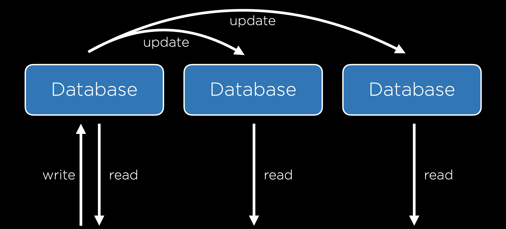

        

            

                <aside class="col-md">

                    <header>
# [CS50’s Web Programming with Python and JavaScript](../..)

OpenCourseWare

[Brian Yu](https://brianyu.me)  
&#10;[brian@cs.harvard.edu](mailto:brian@cs.harvard.edu)

[David J. Malan](https://cs.harvard.edu/malan/)  
&#10;[malan@harvard.edu](mailto:malan@harvard.edu)  
&#10;[<i class="fab fa-facebook-f"></i>](https://www.facebook.com/dmalan)[<i class="fab fa-github"></i>](https://github.com/dmalan)[<i class="fab fa-instagram"></i>](https://www.instagram.com/davidjmalan/)[<i class="fab fa-linkedin"></i>](https://www.linkedin.com/in/malan/)[<i class="fab fa-quora"></i>](https://www.quora.com/profile/David-J-Malan)[<i class="fab fa-reddit-alien"></i>](https://www.reddit.com/user/davidjmalan)[<i class="fab fa-twitter"></i>](https://twitter.com/davidjmalan)

</header>

                    <button aria-controls="nav" aria-expanded="false" class="btn btn-sm collapsed d-md-none" data-target="aside > nav" data-toggle="collapse">
                        Menu
                    </button>

                    <nav class="collapse d-md-block" id="nav">
- - -

1. [HTML, CSS](../../weeks/0/)

1. [Git](../../weeks/1/)

1. [Python](../../weeks/2/)

1. [Django](../../weeks/3/)

1. [SQL, Models, and Migrations](../../weeks/4/)

1. [JavaScript](../../weeks/5/)

1. [User Interfaces](../../weeks/6/)

1. [Testing, CI/CD](../../weeks/7/)

1. [Scalability and Security](../../weeks/8/)

- - -

- [CS50 Certificate](../../certificate/)

- [FAQs](../../faqs/)

- - -

- [Ed Discussion](https://cs50.harvard.edu/web/ed) for Q&amp;A

- [Quick Start Guide](https://us.edstem.org/quickstart/ed-discussion.pdf)

- - -

- [edX](https://cs50.edx.org/web)

- [iTunes U](https://itunes.apple.com/us/course/id1505432709)

- [YouTube](https://www.youtube.com/playlist?list=PLhQjrBD2T380xvFSUmToMMzERZ3qB5Ueu)

- - -

- [Changelog](https://cs50.noticeable.io/)

- [Status Page](https://cs50.statuspage.io/)

- - -

-

    [Communities](../../communities/)

- [Discord](https://discord.gg/cs50)

- [Facebook Group](https://www.facebook.com/groups/cs50/)

- [Facebook Page](https://www.facebook.com/cs50/)

- [GitHub](https://github.com/cs50)

- [Gitter](https://gitter.im/cs50/x)

- [Instagram](https://instagram.com/cs50)

- [LinkedIn Group](https://www.linkedin.com/groups/7437240/)

- [LinkedIn Page](https://www.linkedin.com/school/CS50/)

- [Quora](https://www.quora.com/topic/CS50)

- [Slack](https://cs50.edx.org/slack)

- [Snapchat](https://www.snapchat.com/add/cs50)

- [Twitter](https://twitter.com/cs50)

- [YouTube](http://www.youtube.com/subscription_center?add_user=cs50tv)

- - -

- - -

[<i class="fab fa-creative-commons mr-1"></i>License](../../license/)

</nav>

                    <footer></footer>

                </aside>

                <main class="col-md markdown-body">

                    # Lecture 8

  - [Introduction](#introduction)
  - [Scalability](#scalability)
  - [Scaling](#scaling)
  - [Load Balancing](#load-balancing)
  - [Autoscaling](#autoscaling)    
                  - [Server Failure](#server-failure)

  - [Scaling Databases](#scaling-databases)    
                  - [Database Replication](#database-replication)

  - [Caching](#caching)
  - [Security](#security)    
                  - [Git and GitHub](#git-and-github)

  - [HTML](#html)
  - [HTTPS](#https)    
                  - [Secret-Key Cryptography](#secret-key-cryptography)
                  - [Public-Key Cryptography](#public-key-cryptography)

  - [Databases](#databases)    
                  - [APIs](#apis)
                  - [Environment Variables](#environment-variables)

  - [JavaScript](#javascript)    
                  - [Cross-Site Request Forgery](#cross-site-request-forgery)

  - [What’s next?](#whats-next)

## Introduction

  - So far, we’ve discussed how to build simple web pages using HTML and CSS, and how to use Git and GitHub in order to keep track of changes to our code and collaborate with others. We also familiarized ourselves with the Python programming language, started using Django to create web applications, and learned how to use Django models to store information in our sites. We then introduced JavaScript and learned how to use it to make web pages more interactive, and talked about using animation and React to further improve our User Interfaces. We then talked about some best practices in software development and some technologies commonly used to achieve those best practces.
  - Today, in our final lecture, we’ll discuss the issues of scaling up and securing our web applications.

## Scalability

So far in this course, we’ve built applications that are run only locally on our computers, but eventually, we’ll want to launch our sites so they canbe accessed by anyone on the internet. In order to do this, we run our sites on **servers**, which are physical pieces of hardware dedicated to running applications. Servers can either be on-premise (We own and maintain physical servers where our application is hosted) or on the cloud (servers are owned by a different company such as Amazon or Google, and we pay to rent server space where our application is hosted). There are benefits and drawbacks to both options:

  - **Customization**: Hosting your own servers gives you the ability to decide exactly how they work, allowing for more flexibility than cloud-based hosting.
  - **Expertise**: It is much simpler to host an application on the cloud than it is to maintain your own servers.
  - **Cost**: Since server-hosting sites need to make a profit, they will charge you more than it costs them to maintain their on-premise servers, making cloud-based servers more expensive. However, the startup costs of running on-premise servers can be high, as you need to purchase physical servers and potentially hire someone with the expertise to set them up.
  - **Scalability**: Scaling is typically easier when hosting on the cloud. For example, if we host a site on premise that gets 500 visits per day, and then it starts getting 500,000 visits per day, we would have to order and setup more physical servers to handle the requests, and in the mean time many of our users will not be able to access the site. Most cloud hosting sites will allow you to rent server space flexibly, paying based on how much action your site sees.

When a user sends an HTTP request to this server, the server should send back a response. However, in reality, most servers get far more than one request at a time, as depicted below:

This is where we run into the issue of scalability. A single server can handle only so many requests at once, forcing us to make plans about what to do when our one server is overworked. Whether we decide to host on premise or on the cloud, we have to determine how many requests a server can handle without crashing, which can be done using any number of **benchmarking** tools including Apache Bench.

## Scaling

Once we have some upper limit on how many requests our server can handling, we can begin thinking about how we want to handle the scaling of our application. Two different approaches to scaling include:

  1. **Vertical Scaling**: In vertical scaling, when our server is overwhelmed we simply buy or build a larger server. This strategy is limited however, as there is an upper limit on how powerful a single server can be.
  1. **Horizontal Scaling**: In horizontal scaling, when our server is overwhelmed we buy or build more servers, and then split the requests among our multiple servers.

## Load Balancing

When we use horizontal scaling, we are faced with the additional problem of how we decide which servers are assigned to which requests. We answer that question by employing a **load balancer**, which is another piece of hardware that intercepts incoming requests, and then assigns those requests to one of our servers. There are a number of different methods for deciding which server receives which request, but here are a few:

  - **Random**: In this simple method, the load balancer will decide randomly which server it should assign a request to.
  - **Round-Robin**: In this method, the load balancer will alternate which server receives an incoming request. If we have three servers, the first request might go to server A, the second to server B, the third to server C, and the fourth back to server A.
  - **Fewest Connections**: In this method, the load balancer looks for the server that is currently handling the fewest requests, and assigns the incoming request to that server. This allows us to make sure we’re not overworking one particular server, but it also takes longer for the load balancer to calculate the number of requests each server is currently handling than it dows for it to simply choose a random server.

There is no method of load balancing that is strictly better than all other methods, and there are many different methods used in practice. One problem that can arise when scaling horizontally is that we might have sessions that are stored on one server but not another, and we don’t want users to have to re-enter information just because the load balancer pushes their request to a new server. Like many problems of scalability, there are multiple approaches to solving the problem of sessions:

  - **Sticky Sessions**: Once a user visits a site, the load balancer remembers which server they were sent to first, and makes sure to send them to the same one. One big concern with this method is that we could end up having a large number of users sticking to one server, causing it to crash.
  - **Database Sessions**: All sessions are stored in a database that all servers have access to. This way, a user’s information will be available no matter which server they are assigned to. The drawback here is that it takes additional time and computing power to read from and write to a database.
  - **Client-Side Sessions**: Rather than storing information on our servers, we can choose to store them locally on the user’s web browser as cookies. The drawbacks to this method include the security concern of users creating false cookies that allow them to log in as another user, and the computational concern of sending cookie information back and forth with every request.

Like with load balancing, there is no best answer to the sessions problem, and the method you choose will often depend on your specific circumstances.

## Autoscaling

Another problem that we could run into is that many websites are visited much more frequently at certain times. For example, if we decide to launch our “Is it New Year’s?” app from earlier, we might expect it to get a lot more traffic in late December to early January than any other time of year. If we buy enough servers for the site to stay active during the winter, those servers would be sitting idle for the rest of the year, wasting space and energy. This scenario has brought about the idea of **autoscaling** which has become common in cloud computing, where the number of servers being used by your site can grow and shrink based on the number of requests it gets. Autoscaling is not a perfect solution though, as it takes time to determine that a new server is needed and to launch that server. Another potential problem is that the more servers you have running, the more opportunity there is for one to fail.

### Server Failure

Having multiple servers though, can help to avoid what is known as a **Single Point of Failure**, which is a piece of hardware that, after failing, will cause the entire site to crash. When scaling horizontally, the load balancer can detect which servers have crashed by sending periodic **heartbeat** requests to each server, and then stop assigning new requests to servers that have crashed. At this point, it seems we have simply moved our single point of failure from a server to the load balancer, but we can account for this by having backup load balancers available if our original happens to crash.

## Scaling Databases

In addition to scaling our servers that process requests, we’ll also want to think of ways to scale our Databases. In this course we use SQLite which stores data inside a file on the server, but as we store more and more data, it sometimes makes more sense to store data in a number of different files, and maybe even on a separate server. This brings up the problem then of what to do when our database server can no longer handle all of the requests coming in. Like in other issues of scalability, there are a number of methods we can use to mitigate this problem:

  - **Vertical Partitioning**: This is a method similar to the one we used when first discussing SQL, where we split our data into multiple different tables rather than having redundant information in one table. (Feel free to look back on lecture 4 where we split the `flights` table into a `flights` table and an `airports` table).
  - **Horizontal Partitioning**: This method involves storing multiple tables with the same format, but different information. For example, we could split a `flights` table into a `domestic_flights` table and an `international_flights` table. This way, when we wish to search for a flight from JFK to LHR, we don’t have to waste time searching through a table full of domestic flights. One drawback to this method is that it can be expensive to join multiple tables once they have been split.

### Database Replication

Even after we’ve scaled a database, it seems we’re still left with a single point of failure. If our database server crashes, all of our data could be lost. Just as we added more servers to avoid a single point of failure, we can add copies of our database to make sure the failure of one database does not shut down our application. Also like before there are different methods of database replication, two of the most popular of which are:

  - **Single-Primary Replication**: In this method there are multiple databases, but only one of them is considered to be the primary database, meaning you can read from and write to one of the databases, but only read from each of the others. When the primary database is updated, the other databases are then updated to match the primary one. One drawback of this method is that it still contains a single point of failure when it comes to writing to the database.

  - **Multi-Primary Replication**: In this method, all of the databases can be read from and written to. This solves the problem of a single point of failure, but it comes with a tradeoff: it is now much more difficult to keep all databases up to date because each database must be aware of changes to all other databases. This system also sets us up for the possibility of some conflicts:

                  - **Update Conflict**: With multiple databases, one user may attempt to edit a row in one database while another user attempts to edit that same row in a different database, causing a problem when the databases sync up.
                  - **Uniqueness Conflict**: Every row in a SQL database must have a unique identifier, and we may run into the problem that we assign the same id to two different entries in two different databases.
                  - **Delete Conflict**: One user may delete a row while another user attempts to update it.

## Caching

Whenever we’re working with larger databases, it is important to recognize that every interaction we have with a database is costly. Therefore, we wish to minimize the number of calls to our database server. Let’s look, for example, at the [New York Times](https://www.nytimes.com/) website. The New York Times may have some database with all of their articles which is queried and some template that is rendered every time someone loads the home page, but this would be a waste of resources, as the articles displayed on the home page likely do not change much from second to second. One way we can deal with this problem is by using **Caching**, which is the idea of storing some information in a more accessible location if we anticipate needing it again in the near future.

One way that caching can be implemented is by storing data on the user’s web browser, so that when a user loads certain pages, no request to the server even needs to be sent. One way to do this is by including this line in the header of an HTTP response:

<pre class="highlight"><code>Cache-Control: max-age=86400
</code></pre>

This will tell the browser that when visiting a page, as long as I have visited that page within the last 86400 milliseconds, no request has to be made to the server. This method is used commonly by web browsers especially with files that are less likely to change over short periods such as a CSS file. To take more control over this process, we can also add an `ETag` to the HTTP response header, which is a unique sequence of characters that represents a specific version of a document. This is useful because future requests can include this tag and compare it to the tag of the latest document on the server, only returning an entire document when the two differ.

In addition to the client-side caching discussed above, it can often be helpful to include a cache on the server side. With this cache, our backend setup will look a bit like the one below, where all servers have access to a cache.

Django provides its own [cache framework](https://docs.djangoproject.com/en/3.0/topics/cache/) which will allow us to incorporate caching in our projects. This framework offers several ways of implementing a cache:

  - **Per-View Caching**: This allows us to decide that once a specific view has been loaded, that same view can be rendered without going through the function for the next specified amount of time.
  - **Template-Fragment Caching**: This caches specific parts of a template so they do not have to be re-rendered. For example, we may have a navigation bar that rarely changes, meaning we could save time by not reloading it.
  - **Low-Level Cache API**: This allows you to do more flexible caching, essentially storing any information you would like to.

We won’t go into the details here of how to implement caching in Django, but do take a look at the [documentation](https://docs.djangoproject.com/en/3.0/topics/cache/) if you’re interested!

## Security

Now, we’ll begin to discuss how to make sure our web applications are secure, which will involve many different measures that span nearly every topic we’ve discussed in this course.

### Git and GitHub

One of the greatest strengths of Git and GitHub is how easy they make it to share and contribute to **open-source software**, which can be seen and contributed to by anyone on the internet. One drawback to this is that if at any point you commit a file that includes some private credentials like a password or API key, those credentials could be publicly available.

## HTML

There are many vulnerabilities that arise from using HTML. One common weakness is known as a **Phishing Attack**, which occurs when a user who thinks they are going to one page is actually taken to another. These are not necesarily things we can account for when designing a website, but we should definitely keep them in mind when interacting with the web ourselves. For example, a malicious user might write out this HTML:

<pre class="highlight"><code>&lt;!DOCTYPE html&gt;
&lt;html lang="en"&gt;
    &lt;head&gt;
        &lt;title&gt;Link&lt;/title&gt;
    &lt;/head&gt;
    &lt;body&gt;
        &lt;a href="https://cs50.harvard.edu/"&gt;https://www.google.com/&lt;/a&gt;
    &lt;/body&gt;
&lt;/html&gt;
</code></pre>

Which acts like this:

The fact that HTML is actually sent to a user as part of a request opens up more vulnerabilities, because everyone has access to the layout and style that allowed you to create your site. For example, a hacker could go to [bankofamerica.com](https://cs50.harvard.edu/), copy all of their HTML, and paste it in their own site, creating a site that looks exactly like Bank of America’s. The hacker could then redirect the login form on the page so all usernames and passwords are sent to them. (Also, here’s the [real Bank of America link](https://www.bankofamerica.com/)–just wanted to see if you were checking urls before clicking!)

## HTTPS

As we discussed earlier in the course, most interactions that occur online follow HTTP protocol, although now more and more transactions use HTTPS, which is an encrypted version of HTTP. While using these protocols, information is transferred from one computer to another through a series of servers as pictured below.

There is often no way to ensure that all of these transfers are secure, so it is important that all of this transferred information is **encrypted**, meaning that the characters of the message are altered so that the sender and receiver of the message can understand it, but no one else can.

### Secret-Key Cryptography

One approach to this is known as **Secret-Key Cryptography**. In this approach, the sender and receiver both have access to a secret key that only they know. Then, the secret key is used by the sender to encrypt a message which is then sent to the recipient who uses the secret key to decrypt the message. This method is extremely secure, but it produces a big problem when it comes to practicality. In order for it to work, both the sender and the receiver must have access to the secret key, which means they must meet in person to exchange a key securely. With the number of different websites we interact with on a daily basis, it is clear that in-person meetups are not an option.

### Public-Key Cryptography

An incredible advancement in cryptography that allows the internet to function as it does today is known as **Public-Key Cryptography**. In this method, there are two keys: one is public and can be shared, and the other must be kept private. Once these keys are established (there are several different mathematical methods for creating pairs of keys which could make up an entire course on their own, so we won’t discuss them here), a sender could look up the public key of a recipient and use it to encrypt a message, and then the recipient could use their private key to decrypt the message.  When we use HTTPS rather than HTTP, we know that our request is being secured using public-key encryption.

## Databases

In addition to our requests and responses, we must also make sure that our databases are secure. One common thing we’ll need to store is user information, including usernames and passwords as in the table below:

However, you never actually want to store passwords in plaintext in case an unauthorized person gets access to your database. Instead, we’ll want to use a **hash function**, a function that takes in some text and outputs a seemingly random string, to create a hash of each password, as in the table below:

It is important to note that a hash function is **one-way**, meaning it can turn a password into a hash, but cannot turn a hash back into a password. This means that any company that stores user information this way does not actually know any of the users’ passwords, meaning each time a user attempts to sign in, the entered password will be hashed and compared to the existing hash. Thankfully, this process is already handled for us by Django. One implication of this storage technique is that when a user forgets their password, a company has no way of telling them what their old password now, meaning they would have to make a new one.

There are some cases where you’ll have to decide as a developer how much information you are willing to leak. For example, many sites have a page for forgotten passwords that looks like this:

As a developer, you may want to include either a success or error message after submission:

But notice how by typing in emails, anyone could determine who has an email registered with that site. This could be totally fine in cases where whether or not a person uses the site is inconsequential (maybe Facebook), but extremely reckless if the fact that you are a member of a certain site could put you in danger (maybe an online support group for victims of abuse).

Another way data could be leaked is in the time it takes for a response to come back. It probably takes less time to reject someone with an invalid email than a person with a correct email address and a wrong password.

As we discussed earlier in the course, we must be ware of SQL Injection Attacks whenever we use straight SQL queries in our code.

### APIs

We often use JavaScript in conjunction with APIs to build single-page applications. In the case when we build our own API, there are a few methods we can use to keep our API secure:

  - **API Keys**: Only process requests from API clients who have a key you have provided to them.
  - **Rate Limiting**: Limit the number of requests any one user can make in a given time frame. This helps protect against **Denial of Service (DOS) Attacks**, in which a malicious user makes so many calls to your API that it crashes.
  - **Route Authentication**: There are many cases where we don’t want to give everyone access to all of our data, so we can use route authentication to make sure only specific users can see specific data.

### Environment Variables

Just as we want to avoid storing passwords in plaintext, we’ll want to avoid including API keys in our source code. One common way of avoiding this is to use **environment variables**, or variables that are stored in your operating system or server’s environment. Then, rather than including a string of text in our source code, we can include a reference to an environment variable.

## JavaScript

There are a few types of attacks that malicious users may attempt using JavaScript. One example is knwon as **Cross-Site Scripting**, which is when a user writes their own  JavaScript code and runs it on your website. For example, let’s imagine we have a Django application with a single URL:

<pre class="highlight"><code>urlpatterns = [
    path("&lt;path:path&gt;", views.index, name="index")
]
</code></pre>

and a single view:

<pre class="highlight"><code>def index(request, path):
    return HttpResponse(f"Requested Path: {path}")
</code></pre>

This website essentially tells the user what URL they have navigated to:

But a user can now easily insert some Javascript into the page by typing it in the url:

While this `alert` example is fairly harmless, it wouldn’t be all that more difficult to include some JavaScript that manipulates the DOM or uses `fetch` to send a request.

### Cross-Site Request Forgery

We already discussed how we can use Django to prevent CSRF attacks, but let’s take a look at what could happen without this protection. As an example, imagine a bank has a URL you could visit that transfers money out of your account. A person could easily create a link that would make this transfer:

<pre class="highlight"><code>&lt;a href="http://yourbank.com/transfer?to=brian&amp;amt=2800"&gt;
    Click Here!
&lt;/a&gt;
</code></pre>

This attack can be even more subtle than a link. If the URL is put in an image, then it will be accessed as your browser attempts to load the image:

<pre class="highlight"><code> &lt;img src="http://yourbank.com/transfer?to=brian&amp;amt=2800"&gt;
</code></pre>

Because of this, whenever you are building an application that can accept some state change, it should be done using a POST request. Even if the bank requires a POST request, hidden form fields can still trick users into accidentally submitting a request. The following form doesn’t even wait for the user to click; it automatically submits!

<pre class="highlight"><code> &lt;body onload="document.forms[0].submit()"&gt;
    &lt;form action="https://yourbank.com/transfer"
    method="post"&gt;
        &lt;input type="hidden" name="to" value="brian"&gt;
        &lt;input type="hidden" name="amt" value="2800"&gt;
        &lt;input type="submit" value="Click Here!"&gt;
    &lt;/form&gt;
&lt;/body&gt;
</code></pre>

The above is an example of what **Cross-Site Request Forgery** might look like. We can stop attacks such as these by creating a CSRF token when loading a webpage, and then only accepting forms with a valid token.

## What’s next?

We’ve discussed many web frameworks in this class such as Django and React, but there are more frameworks you might be interested in trying:

  - Server-Side

                  - [Express.js](https://expressjs.com/)
                  - [Ruby on Rails](https://rubyonrails.org/)
                  - [Flask](https://flask.palletsprojects.com/en/1.1.x/)
                  - …

  - Client-Side

                  - [Angular JS](https://angularjs.org/)
                  - [React](https://reactjs.org/)
                  - [Vue.js](https://vuejs.org/)
                  - [React Native](https://reactnative.dev/)
                  - …

In the future, you may also want to be able to deploy your site to the web, which you can do through a number of different services:

  - [Amazon Web Services](https://aws.amazon.com/getting-started/hands-on/websites/)
  - [GitHub](https://github.com/)
  - [Heroku](https://www.heroku.com/)
  - [Netlify](https://app.netlify.com/)
  - [Google Cloud](https://cloud.google.com/)
  - [Microsoft Azure](https://azure.microsoft.com/en-gb/)
  - …

We’ve come a long way and covered a lot of material since the beginning of this course, but there’s still a lot to learn in the world of web programming. Although it can be overwhelming at times, one of the best ways to learn more is to jump into a project and see how far you can run with it. We believe that at this point you have a strong foundation in the concepts of web design, and that you have what it takes to turn an idea into your own working website!

                </main>

            

        

