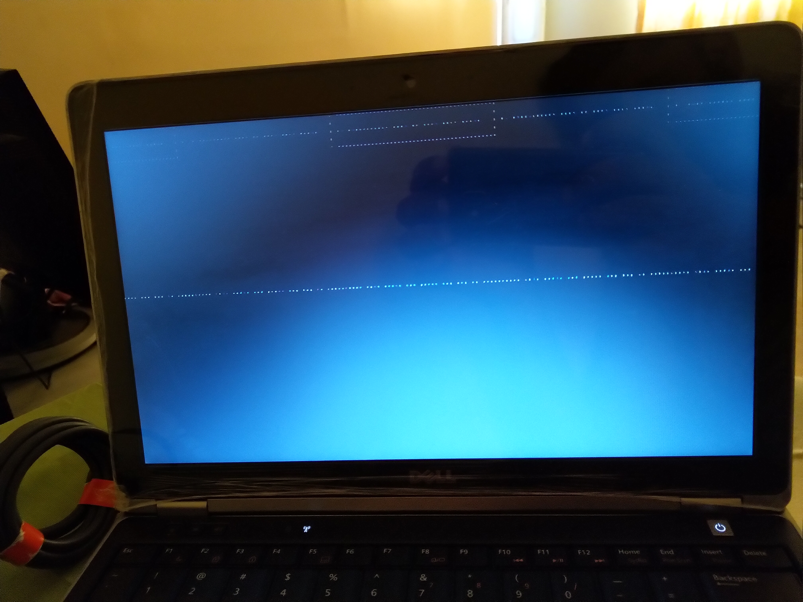

#   Windows

*   [Google Chrome](https://www.google.com/chrome/?brand=CHBD&gclid=Cj0KCQjw-_j1BRDkARIsAJcfmTEmjwvoL30Ns6wDPgts8vPOe--Kn-LysITHUKQuX4jmdsUe8gokwLwaAuuXEALw_wcB&gclsrc=aw.ds)
*   [Adobe Acrobat Reader DC](https://get.adobe.com/uk/reader/otherversions/)
*   [Adobe Premier Pro 2020]
*   [Atom]
*   [Dell SupportAssist]
*   [Deluge-torrent](https://deluge-torrent.org/)
*   [git](https://git-scm.com/)
*   [Internet Download Manager]
*   [Microsoft Office Professional Plus]
*   [PostgreSQL](https://www.google.com/chrome/?brand=CHBD&gclid=Cj0KCQjw-_j1BRDkARIsAJcfmTEmjwvoL30Ns6wDPgts8vPOe--Kn-LysITHUKQuX4jmdsUe8gokwLwaAuuXEALw_wcB&gclsrc=aw.ds)
*   [Python](https://www.python.org/)
*   [Typora](https://typora.io/)
*   [VideoLAN - VLC](https://www.videolan.org/vlc/index.html)
*   [Windows Terminal](https://www.microsoft.com/en-pk/p/windows-terminal/9n0dx20hk701?activetab=pivot:overviewtab)


##  Black Screen stucks while installing windows

*   It appeared when I booted my laptop from **USB** to install windows.
*   After installation this screen appeared.
*   Because default boot option is empty
*   Press <kbd>F12</kbd> on *Dell* machines
*   Select a correct option to boot from


##  During Installation
Error: `We couldn't create a new partition. [Error: 0x82f130d0]`.

### Solution
*   Press <kbd>Shift</kbd> + <kbd>F10</kbd> to open CMD
*   `diskpart`:
    ```CMD
    Microsoft DiskPart version 10.0.143939.0

    Copyright (C) 1999-2013 Microsoft Corporation.
    On computer: MINWINPC
    ```
*   `list disk`:
    ```CMD
    Disk ###    Status          Size        Free        Dyn     Gpt
    --------    -------------   --------    --------    ---     ---
    Disk 0      Online              20 GB       15 GB
    ```
*   `select disk 0`:
    ```CMD
    Disk 0 is now the selected disk.
    ```
*   `clean`:
    ```CMD
    DiskPart succeeded in cleaning the disk.
    ```
*   `convert GPT`
    ```CMD
    DiskPart successfully converted the selected disk to GPT format.
    ```
*   `exit`
    ```CMD
    Leaving DiskPart...
    ```
*   `exit` again


Some othe commands

*   `create partition primary size=5000`:
    ```CMD
    DiskPart succeeded in creating the specified partition.
    ```
*   `format fs=ntfs`:
    ```CMD
    100 percent completed
    ```
*   `assign`:
    ```CMD
    DiskPart successfully assigned the drive letter or mount point.
    ```
*   `active`:
    ```CMD
    DiskPart marked the current partition as active.
    ```
*   `list volume`
    ```CMD
    Volume ###      Ltr     Label           Fs      Type            Size        Status          Info
    -----------     ----    -----------     -----   ------------    ---------   -------------   ---------
    Volume 0        D       CCSA_X86FRE     UDF     DVD-ROM         3225 MB     Healthy
    Volume 1        C                       NTFS    Partition       5000 MB     Healthy
    ```
